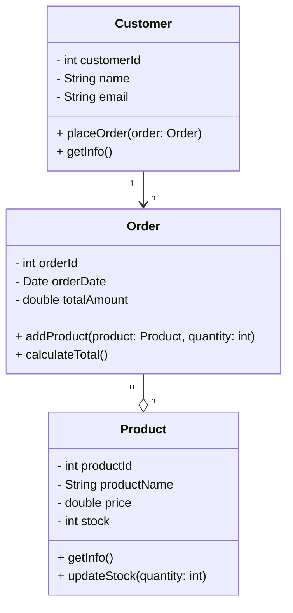

## 1. Sơ đồ Class (Mermaid)

<h1>Bảng mô tả chức năng từng lớp</h1>
<table>
  <thead>
    <tr>
      <th>Lớp</th>
      <th>Thuộc tính (Attributes)</th>
      <th>Phương thức (Methods)</th>
      <th>Chức năng chính (Function)</th>
    </tr>
  </thead>
  <tbody>
    <tr>
      <td><b>Product</b></td>
      <td>
        productId: mã sản phẩm 
        productName: tên sản phẩm 
        price: giá bán 
        stock: số lượng tồn
      </td>
      <td>
        getInfo(): hiển thị thông tin sản phẩm 
        updateStock(quantity): cập nhật tồn kho
      </td>
      <td>
        Quản lý thông tin chi tiết sản phẩm, giá và số lượng hàng hóa hiện có trong kho.
      </td>
    </tr>
    <tr>
      <td><b>Customer</b></td>
      <td>
        customerId: mã khách hàng 
        name: tên khách hàng 
        email: địa chỉ email
      </td>
      <td>
        placeOrder(order): tạo đơn hàng mới 
        getInfo(): hiển thị thông tin khách hàng
      </td>
      <td>
        Đại diện cho người mua hàng, cho phép tạo và theo dõi các đơn hàng đã đặt.
      </td>
    </tr>
    <tr>
      <td><b>Order</b></td>
      <td>
        orderId: mã đơn hàng 
        orderDate: ngày đặt hàng 
        totalAmount: tổng tiền đơn 
        products: danh sách sản phẩm trong đơn
      </td>
      <td>
        addProduct(product, quantity): thêm sản phẩm vào đơn hàng 
        calculateTotal(): tính tổng tiền đơn hàng
      </td>
      <td>
        Lưu trữ thông tin về từng đơn hàng, danh sách sản phẩm, số lượng và tính tổng chi phí.
      </td>
    </tr>
  </tbody>
</table>

<h1>Bảng quan hệ giữa các lớp</h1>
<table>
  <thead>
    <tr>
      <th>Từ lớp</th>
      <th>Đến lớp</th>
      <th>Kiểu quan hệ (Association)</th>
      <th>Giải thích</th>
    </tr>
  </thead>
  <tbody>
    <tr>
      <td>Customer</td>
      <td>Order</td>
      <td><b>1–n (One-to-Many)</b></td>
      <td>Một khách hàng có thể có nhiều đơn hàng.</td>
    </tr>
    <tr>
      <td>Order</td>
      <td>Product</td>
      <td><b>n–n (Many-to-Many)</b></td>
      <td>Một đơn hàng chứa nhiều sản phẩm, và một sản phẩm có thể thuộc nhiều đơn hàng khác nhau.</td>
    </tr>
  </tbody>
</table>
