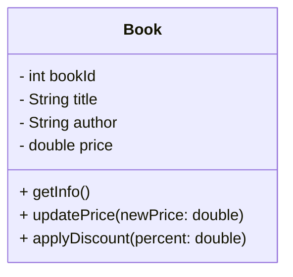

## Mô hình UML

```mermaid
classDiagram
    class Book {
        - int bookId
        - String title
        - String author
        - double price
        + getInfo()
        + updatePrice(newPrice: double)
        + applyDiscount(percent: double)
    }
```
