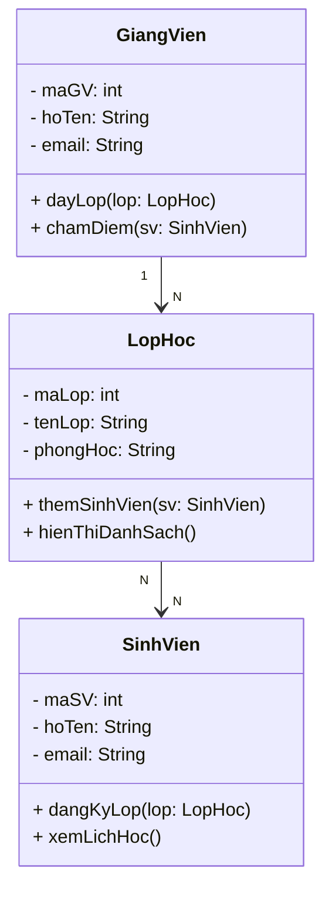

```mermaid
classDiagram
    class GiangVien {
        - maGV: int
        - hoTen: String
        - email: String
        + dayLop(lop: LopHoc)
        + chamDiem(sv: SinhVien)
    }

    class LopHoc {
        - maLop: int
        - tenLop: String
        - phongHoc: String
        + themSinhVien(sv: SinhVien)
        + hienThiDanhSach()
    }

    class SinhVien {
        - maSV: int
        - hoTen: String
        - email: String
        + dangKyLop(lop: LopHoc)
        + xemLichHoc()
    }

    GiangVien "1" --> "N" LopHoc
    LopHoc "N" --> "N" SinhVien
```
