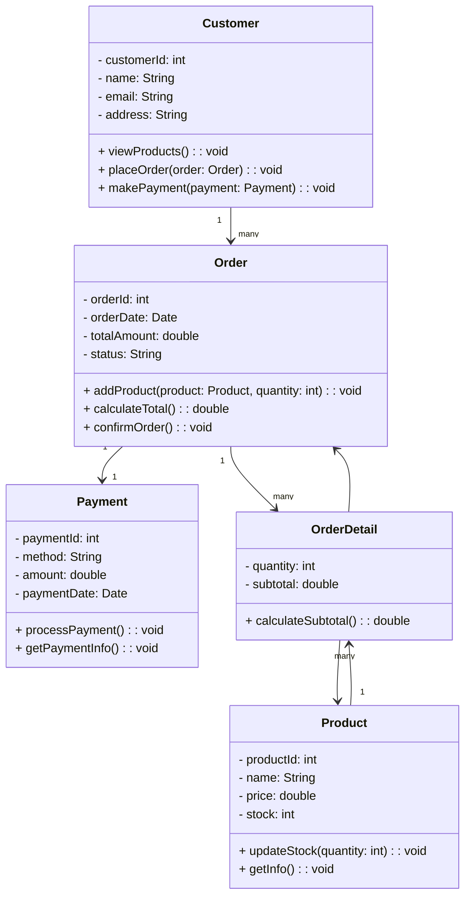

```mermaid
classDiagram
    class Customer {
        - customerId: int
        - name: String
        - email: String
        - address: String
        + viewProducts(): void
        + placeOrder(order: Order): void
        + makePayment(payment: Payment): void
    }

    class Product {
        - productId: int
        - name: String
        - price: double
        - stock: int
        + updateStock(quantity: int): void
        + getInfo(): void
    }

    class Order {
        - orderId: int
        - orderDate: Date
        - totalAmount: double
        - status: String
        + addProduct(product: Product, quantity: int): void
        + calculateTotal(): double
        + confirmOrder(): void
    }

    class Payment {
        - paymentId: int
        - method: String
        - amount: double
        - paymentDate: Date
        + processPayment(): void
        + getPaymentInfo(): void
    }

    class OrderDetail {
        - quantity: int
        - subtotal: double
        + calculateSubtotal(): double
    }


    %% 1 khách hàng có nhiều đơn hàng
    Customer "1" --> "many" Order

    %% 1 đơn hàng có nhiều sản phẩm, 1 sản phẩm có trong nhiều đơn hàng (qua OrderDetail)
    Order "1" --> "many" OrderDetail
    Product "1" --> "many" OrderDetail
    OrderDetail --> Order
    OrderDetail --> Product

    %% 1 đơn hàng có 1 thanh toán
    Order "1" --> "1" Payment

```
