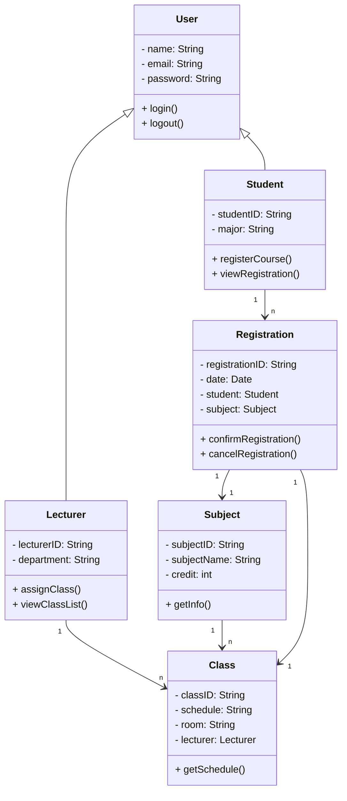

```mermaid
classDiagram
    class User {
        - name: String
        - email: String
        - password: String
        + login()
        + logout()
    }

    class Student {
        - studentID: String
        - major: String
        + registerCourse()
        + viewRegistration()
    }

    class Lecturer {
        - lecturerID: String
        - department: String
        + assignClass()
        + viewClassList()
    }

    class Subject {
        - subjectID: String
        - subjectName: String
        - credit: int
        + getInfo()
    }

    class Class {
        - classID: String
        - schedule: String
        - room: String
        - lecturer: Lecturer
        + getSchedule()
    }

    class Registration {
        - registrationID: String
        - date: Date
        - student: Student
        - subject: Subject
        + confirmRegistration()
        + cancelRegistration()
    }

    %% Quan hệ kế thừa
    User <|-- Student
    User <|-- Lecturer

    %% Quan hệ association
    Lecturer "1" --> "n" Class
    Subject "1" --> "n" Class
    Student "1" --> "n" Registration
    Registration "1" --> "1" Subject
    Registration "1" --> "1" Class

```
