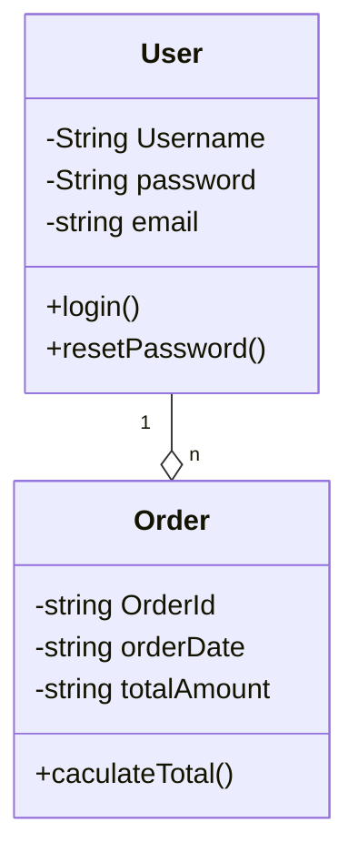

### Giải thích

<ul>
    <li>Lỗi quan hệ giữa các lớp ( có thể ): Nếu chỉ mô tả User có thể đặt hàng, thì ( không cần quản lý vòng đợi thì có thể dùng Association ) nếu muốn quản lý vòng đời oder để thông kê, order tồn tại riêng biệt thì dùng Aggregation</li>
    <li>Lỗi multiplicity: Vì Một User có thể, có nhiều order => 1 -> "n" order</li>
    <li>Lỗi modifier: các thuộc tích bên trong class user, order cần được để private, vì đó là thông tin ca nhân của 1 user "-"</li>
</ul>
