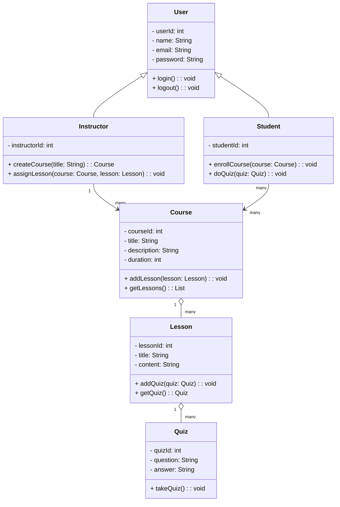

```mermaid
classDiagram
    %% ========== Lớp cơ sở ==========
    class User {
        - userId: int
        - name: String
        - email: String
        - password: String
        + login(): void
        + logout(): void
    }

    %% ========== Lớp kế thừa ==========
    class Student {
        - studentId: int
        + enrollCourse(course: Course): void
        + doQuiz(quiz: Quiz): void
    }

    class Instructor {
        - instructorId: int
        + createCourse(title: String): Course
        + assignLesson(course: Course, lesson: Lesson): void
    }

    %% ========== Lớp chính ==========
    class Course {
        - courseId: int
        - title: String
        - description: String
        - duration: int
        + addLesson(lesson: Lesson): void
        + getLessons(): List<Lesson>
    }

    class Lesson {
        - lessonId: int
        - title: String
        - content: String
        + addQuiz(quiz: Quiz): void
        + getQuiz(): Quiz
    }

    class Quiz {
        - quizId: int
        - question: String
        - answer: String
        + takeQuiz(): void
    }

    %% ========== Quan hệ ==========
    User <|-- Student
    User <|-- Instructor

    Instructor "1" --> "many" Course
    Course "1" o-- "many" Lesson
    Lesson "1" o-- "many" Quiz
    Student "many" --> "many" Course

```
