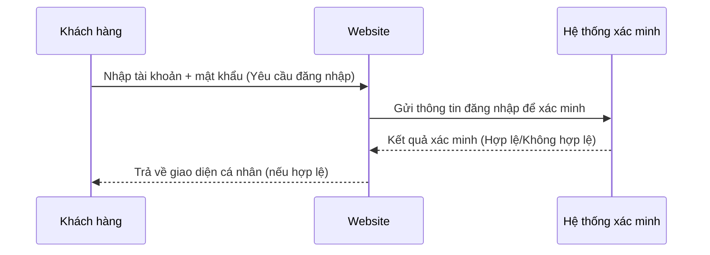

## Phân loại thông điệp
| Loại thông điệp          | Mô tả                                               | Ví dụ trong sơ đồ                                                                           |
| ------------------------ | --------------------------------------------------- | ------------------------------------------------------------------------------------------- |
| **Synchronous Message**  | Bắt buộc chờ phản hồi trước khi tiếp tục.           | Khách hàng → Website (đăng nhập)   Website → Hệ thống xác minh                           |
| **Asynchronous Message** | Không cần chờ phản hồi, có thể thực hiện việc khác. | (Không có trong ví dụ này, vì login thường chờ phản hồi)                                    |
| **Return Message**       | Thông điệp phản hồi từ đối tượng nhận.              | Hệ thống xác minh → Website (trả kết quả)   Website → Khách hàng (trả giao diện cá nhân) |
