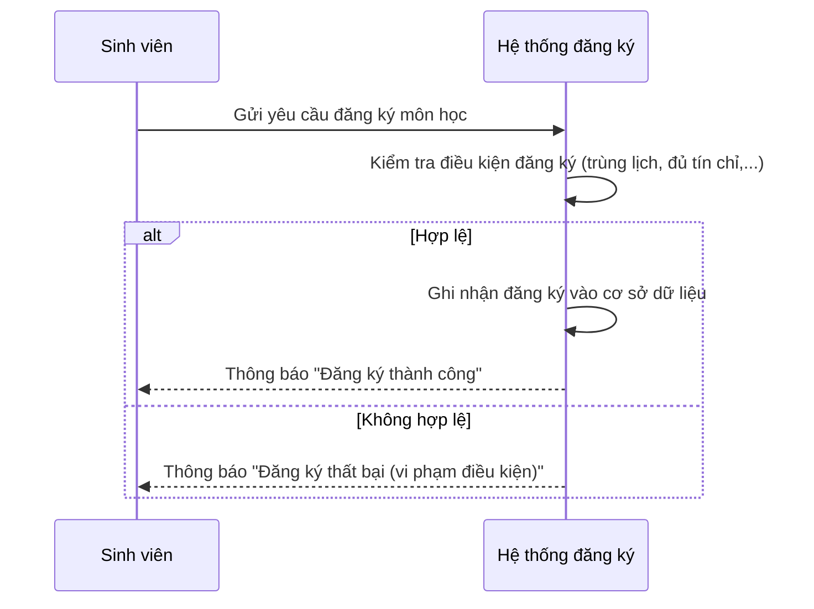

```mermaid
sequenceDiagram
    participant Student as Sinh viên
    participant System as Hệ thống đăng ký

    %% Bước 1: Sinh viên gửi yêu cầu
    Student->>System: Gửi yêu cầu đăng ký môn học

    %% Bước 2: Hệ thống kiểm tra điều kiện
    System->>System: Kiểm tra điều kiện đăng ký (trùng lịch, đủ tín chỉ,...)

    %% Bước 3: Hệ thống ghi nhận đăng ký
    alt Hợp lệ
        System->>System: Ghi nhận đăng ký vào cơ sở dữ liệu
        System-->>Student: Thông báo "Đăng ký thành công"
    else Không hợp lệ
        System-->>Student: Thông báo "Đăng ký thất bại (vi phạm điều kiện)"
    end

```