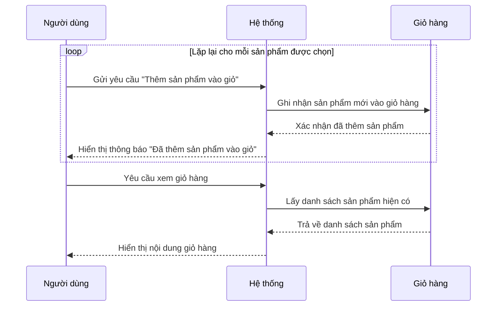

```mermaid
sequenceDiagram
    participant User as Người dùng
    participant System as Hệ thống
    participant Cart as Giỏ hàng

    %% Bước 1: Lặp lại quá trình thêm sản phẩm
    loop Lặp lại cho mỗi sản phẩm được chọn
        User->>System: Gửi yêu cầu "Thêm sản phẩm vào giỏ"
        System->>Cart: Ghi nhận sản phẩm mới vào giỏ hàng
        Cart-->>System: Xác nhận đã thêm sản phẩm
        System-->>User: Hiển thị thông báo "Đã thêm sản phẩm vào giỏ"
    end

    %% Bước 2: Sau khi lặp xong
    User->>System: Yêu cầu xem giỏ hàng
    System->>Cart: Lấy danh sách sản phẩm hiện có
    Cart-->>System: Trả về danh sách sản phẩm
    System-->>User: Hiển thị nội dung giỏ hàng

```