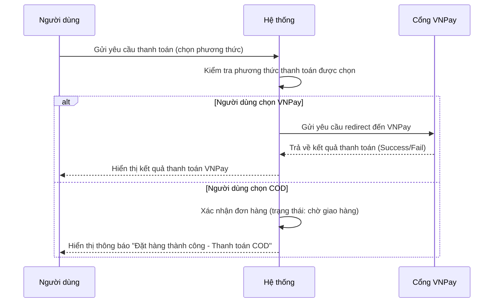

```mermaid
sequenceDiagram
    participant User as Người dùng
    participant System as Hệ thống
    participant VNPay as Cổng VNPay

    %% Bước 1: Người dùng chọn phương thức thanh toán
    User->>System: Gửi yêu cầu thanh toán (chọn phương thức)

    %% Bước 2: Hệ thống kiểm tra loại phương thức
    System->>System: Kiểm tra phương thức thanh toán được chọn

    %% Bước 3: Điều kiện với alt
    alt Người dùng chọn VNPay
        System->>VNPay: Gửi yêu cầu redirect đến VNPay
        VNPay-->>System: Trả về kết quả thanh toán (Success/Fail)
        System-->>User: Hiển thị kết quả thanh toán VNPay
    else Người dùng chọn COD
        System->>System: Xác nhận đơn hàng (trạng thái: chờ giao hàng)
        System-->>User: Hiển thị thông báo "Đặt hàng thành công - Thanh toán COD"
    end

```