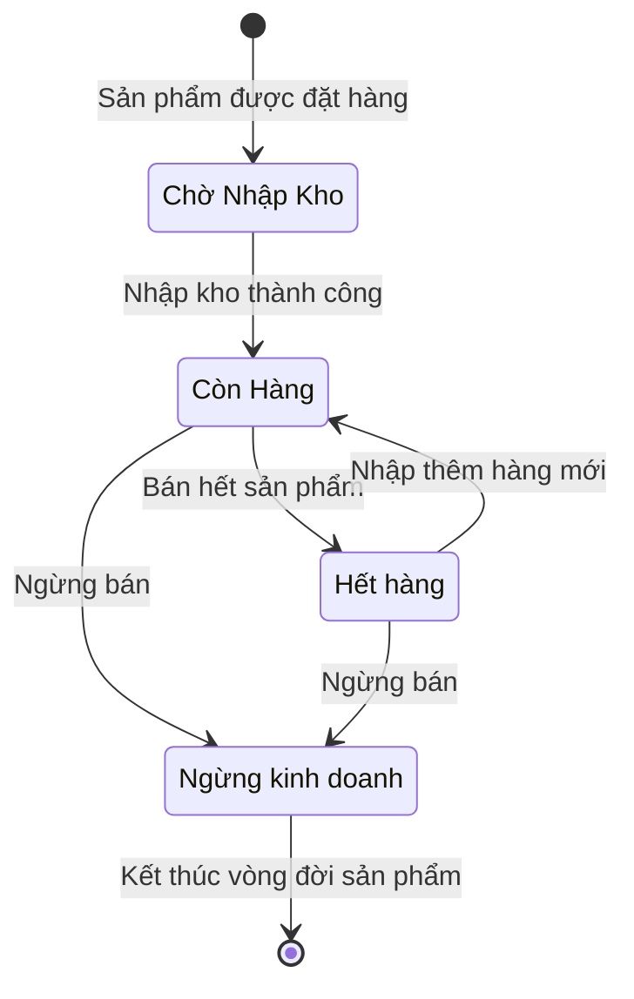

## Logic chuyển trạng thái
| Từ trạng thái       | Đến trạng thái   | Sự kiện kích hoạt (Trigger/Event)         |
| ------------------- | ---------------- | ----------------------------------------- |
| Chờ nhập kho        | Còn hàng         | **Nhập kho thành công**                   |
| Còn hàng            | Hết hàng         | **Bán hết sản phẩm**                      |
| Hết hàng            | Còn hàng         | **Nhập thêm hàng mới**                    |
| Còn hàng / Hết hàng | Ngừng kinh doanh | **Quản lý quyết định ngừng bán sản phẩm** |
