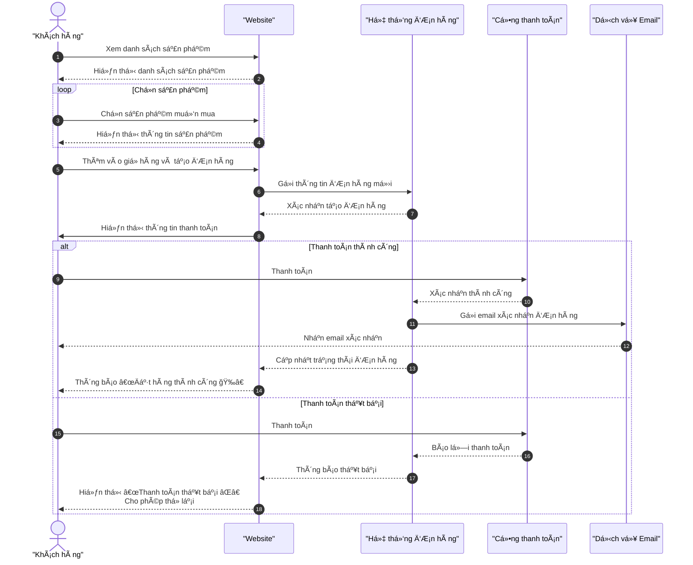

```mermaid
sequenceDiagram
    autonumber
    actor Customer as "Khách hàng"
    participant Website as "Website"
    participant OrderSystem as "Hệ thống đơn hàng"
    participant PaymentGateway as "Cổng thanh toán"
    participant EmailService as "Dịch vụ Email"

    Customer ->> Website: Xem danh sách sản phẩm
    Website -->> Customer: Hiển thị danh sách sản phẩm

    loop Chá»n sản phẩm
        Customer ->> Website: Chá»n sản phẩm muốn mua
        Website -->> Customer: Hiển thị thông tin sản phẩm
    end

    Customer ->> Website: Thêm vào giỠhàng và tạo đơn hàng
    Website ->> OrderSystem: Gửi thông tin đơn hàng mới
    OrderSystem -->> Website: Xác nhận tạo đơn hàng

    Website ->> Customer: Hiển thị thông tin thanh toán

    alt Thanh toán thành công
        Customer ->> PaymentGateway: Thanh toán
        PaymentGateway -->> OrderSystem: Xác nhận thành công
        OrderSystem ->> EmailService: Gửi email xác nhận đơn hàng
        EmailService -->> Customer: Nhận email xác nhận
        OrderSystem -->> Website: Cập nhật trạng thái đơn hàng
        Website -->> Customer: Thông báo “Äặt hàng thành công ğŸ‰â€
    else Thanh toán thất bại
        Customer ->> PaymentGateway: Thanh toán
        PaymentGateway -->> OrderSystem: Báo lỗi thanh toán
        OrderSystem -->> Website: Thông báo thất bại
        Website -->> Customer: Hiển thị “Thanh toán thất bại âŒâ€<br/>Cho phép thá»­ lại
    end

```