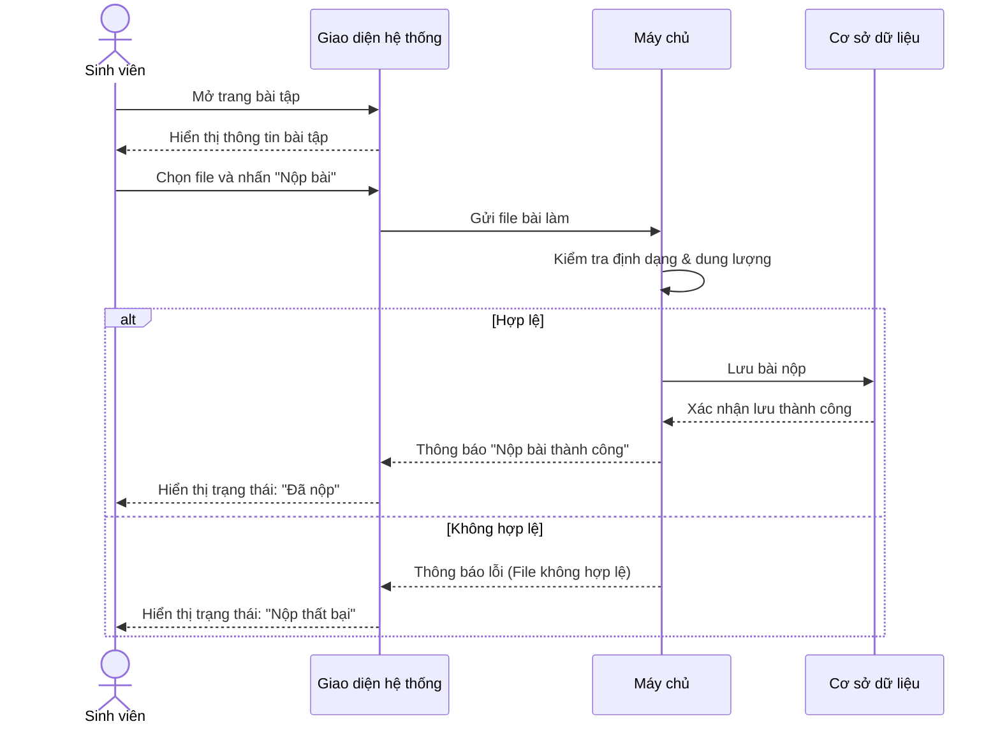

```mermaid
sequenceDiagram
    actor SinhVien as Sinh viên
    participant UI as Giao diện hệ thống
    participant Server as Máy chủ
    participant DB as Cơ sở dữ liệu

    SinhVien->>UI: Mở trang bài tập
    UI-->>SinhVien: Hiển thị thông tin bài tập

    SinhVien->>UI: Chọn file và nhấn "Nộp bài"
    UI->>Server: Gửi file bài làm

    Server->>Server: Kiểm tra định dạng & dung lượng
    alt Hợp lệ
        Server->>DB: Lưu bài nộp
        DB-->>Server: Xác nhận lưu thành công
        Server-->>UI: Thông báo "Nộp bài thành công"
        UI-->>SinhVien: Hiển thị trạng thái: "Đã nộp"
    else Không hợp lệ
        Server-->>UI: Thông báo lỗi (File không hợp lệ)
        UI-->>SinhVien: Hiển thị trạng thái: "Nộp thất bại"
    end

```