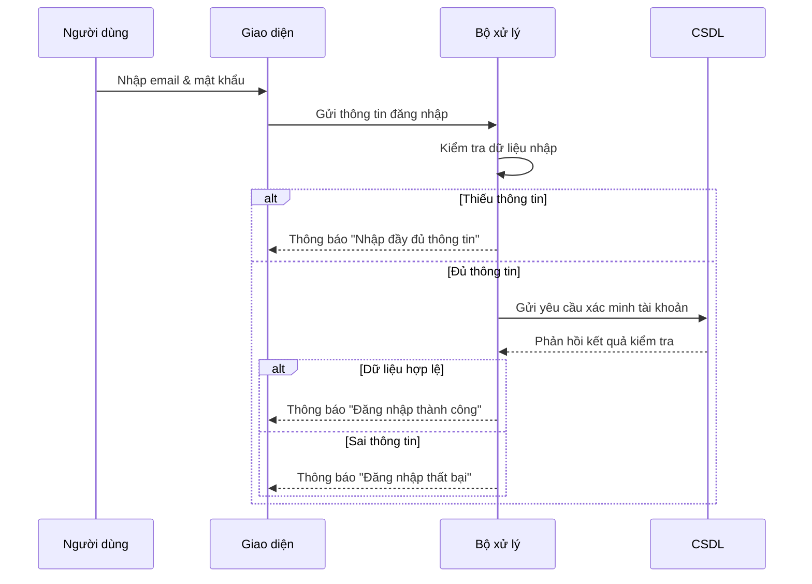
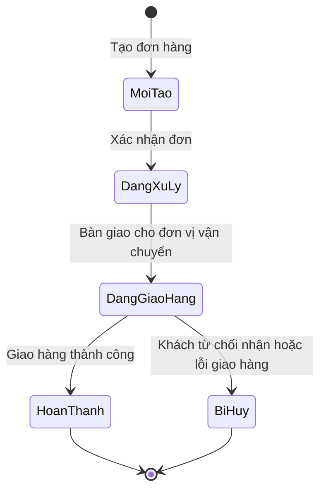

# Lesson 1: Sequence Diagram — Biểu đồ tuần tự

## I. Khái niệm

- Sequence Diagram (Biểu đồ tuần tự) là một loại biểu đồ trong UML dùng để mô tả cách các đối tượng tương tác với nhau theo thời gian để thực hiện một chức năng cụ thể của hệ thống.
- Mỗi đối tượng có thể là một actor, class, component hoặc thực thể khác trong hệ thống.
- Mũi tên biểu diễn thông điệp (message) hoặc lời gọi phương thức giữa các đối tượng.
- Trật tự từ trên xuống dưới thể hiện trình tự (dòng thời gian) thực hiện các hành động.

## II. Mục đích

Sequence Diagram giúp trả lời câu hỏi: “Hệ thống hoạt động như thế nào?”

- Là cầu nối giữa Use Case Diagram (mô tả chức năng) và Class Diagram (mô tả cấu trúc).
- Giúp hiểu rõ luồng xử lý nghiệp vụ bên trong hệ thống.
- Hữu ích để xác định phương thức, thứ tự gọi và mối quan hệ tương tác giữa các đối tượng.
- Hỗ trợ giao tiếp nội bộ nhóm và phân tích chi tiết yêu cầu.

## III. Cấu trúc của Sequence Diagram

- Trục ngang: Các đối tượng tham gia tương tác (actors, objects, components).
- Trục dọc: Dòng thời gian (từ trên xuống dưới).
- Mũi tên: Thể hiện thông điệp hoặc lời gọi hàm (có thể là synchronous, asynchronous, return, v.v.).
- Thanh hoạt động (activation bar): Biểu diễn thời gian một đối tượng đang thực thi hành động.

## IV. So sánh Use Case Diagram và Sequence Diagram

| Tiêu chí         |             Use Case Diagram |                  Sequence Diagram |
| ---------------- | ---------------------------: | --------------------------------: |
| Góc nhìn         |           Bên ngoài hệ thống |                Bên trong hệ thống |
| Câu hỏi trả lời  |           "Hệ thống làm gì?" | "Hệ thống hoạt động như thế nào?" |
| Thành phần chính |            Actor và Use Case |       Các đối tượng và thông điệp |
| Mục đích         | Xác định chức năng tổng quát |    Mô tả chi tiết quy trình xử lý |

## Ví dụ Sequence Diagram – Đăng nhập hệ thống

### Kịch bản:

1. Người dùng nhập email và mật khẩu.
2. Giao diện gửi thông tin đến bộ xử lý.
3. Bộ xử lý kiểm tra thông tin:

- Nếu thiếu dữ liệu → thông báo “Nhập đầy đủ thông tin”.

- Nếu hợp lệ → gửi yêu cầu kiểm tra đến CSDL.

4. CSDL phản hồi kết quả.

- Nếu hợp lệ → thông báo “Đăng nhập thành công”.

- Nếu sai → thông báo “Đăng nhập thất bại”.

## Biểu đồ Sequence (Mermaid)

## VI. Lợi ích của Sequence Diagram

- Giúp hiểu rõ luồng hoạt động thực tế của hệ thống.

- Hỗ trợ phát hiện và thiết kế phương thức, thông điệp, luồng xử lý trong Class Diagram.

- Là tài liệu trực quan để truyền đạt giữa BA, Dev và QA.

# Lesson 2: Các thành phần chính trong Sequence Diagram

## I. Khái niệm chung

Sequence Diagram gồm các **thành phần chính** mô tả quá trình tương tác giữa các đối tượng trong hệ thống theo **thời gian**.  
Mỗi thành phần thể hiện một vai trò cụ thể trong luồng xử lý.

---

## II. Các thành phần chính

### 1. **Actor (Tác nhân)**

- Ký hiệu: Hình người que.
- Đại diện cho người dùng hoặc hệ thống bên ngoài **khởi xướng hành động** đầu tiên.
- _Ví dụ:_ Người dùng nhấn “Đăng nhập”.

---

### 2. **Object (Đối tượng)**

- Ký hiệu: Hình chữ nhật `tenDoiTuong:TenClass`.
- Đại diện cho thành phần **bên trong hệ thống** thực hiện hành động.
- _Ví dụ:_ `formLogin:Form`, `controller:LoginController`, `db:Database`.

---

### 3. **Lifeline (Đường sống)**

- Ký hiệu: Đường **nét đứt** kéo từ Actor hoặc Object xuống.
- Biểu diễn **thời gian tồn tại** của đối tượng trong suốt quá trình tương tác.

---

### 4. **Activation Bar (Thanh kích hoạt)**

- Ký hiệu: Hình **chữ nhật hẹp** trên Lifeline.
- Thể hiện **thời điểm đối tượng đang thực hiện công việc** (xử lý, phản hồi...).

---

### 5. **Message (Thông điệp)**

- Ký hiệu: Mũi tên **nét liền**, đầu đặc.
- Biểu diễn **hành động hoặc lời gọi phương thức** giữa hai đối tượng.
- _Ví dụ:_ `UI → Controller: sendLoginData()`.

---

### 6. **Return Message (Phản hồi)**

- Ký hiệu: Mũi tên **nét đứt**, đầu hở.
- Biểu diễn **kết quả trả về** sau khi xử lý.
- _Ví dụ:_ `Controller → UI: loginSuccess()`.

---

### 7. **Combined Fragment (Khung điều kiện/lặp)**

- Dùng mô tả **logic điều kiện, lựa chọn, lặp hoặc song song**.

<table>
<tr><th>Tên Fragment</th><th>Ý nghĩa</th><th>Ví dụ</th></tr>
<tr><td><b>alt</b></td><td>Rẽ nhánh (if – else)</td><td>Mật khẩu đúng → đăng nhập; sai → báo lỗi</td></tr>
<tr><td><b>opt</b></td><td>Tùy chọn (chạy khi điều kiện đúng)</td><td>Hiển thị thông báo nếu có lỗi</td></tr>
<tr><td><b>loop</b></td><td>Lặp lại hành động</td><td>Gửi yêu cầu đến khi nhận phản hồi hợp lệ</td></tr>
<tr><td><b>par</b></td><td>Xử lý song song</td><td>Vừa kiểm tra dữ liệu, vừa ghi log</td></tr>
</table>

---

## III. Tóm tắt nhanh

| Thành phần        | Ký hiệu / Biểu diễn            | Ý nghĩa chính                      |
| ----------------- | ------------------------------ | ---------------------------------- |
| Actor             | Hình người que                 | Tác nhân khởi xướng hành động      |
| Object            | `ten:Class`                    | Thực hiện hành động trong hệ thống |
| Lifeline          | Đường nét đứt dọc              | Thời gian tồn tại của đối tượng    |
| Activation Bar    | Thanh hẹp trên lifeline        | Giai đoạn đang xử lý               |
| Message           | Mũi tên liền, đầu đặc          | Gọi phương thức / hành động        |
| Return Message    | Mũi tên đứt, đầu hở            | Kết quả trả về                     |
| Combined Fragment | Khung có nhãn alt/opt/loop/par | Mô tả điều kiện, lặp, song song    |

---

# Lesson 3: Phân biệt các loại thông điệp trong Sequence Diagram

| Loại thông điệp  | Ký hiệu           | Ý nghĩa                    | Ví dụ             |
| ---------------- | ----------------- | -------------------------- | ----------------- |
| **Synchronous**  | → (đầu đặc)       | Gọi và chờ phản hồi        | Gọi hàm `login()` |
| **Asynchronous** | → (đầu rỗng)      | Gửi đi, không chờ phản hồi | Gửi API request   |
| **Self**         | ↻                 | Tự gọi chính mình          | `tinhTongTien()`  |
| **Create**       | --→ đối tượng mới | Tạo đối tượng mới          | `new User()`      |
| **Destroy**      | → ❌              | Hủy đối tượng              | `logout()`        |

# Lesson 4: Quy trình xây dựng Sequence Diagram

## I. Khái niệm

**Sequence Diagram** mô tả **trình tự tương tác giữa các đối tượng** trong một kịch bản cụ thể (Use Case).  
Giúp thể hiện **ai làm gì, làm khi nào, theo thứ tự nào** để hoàn thành một chức năng của hệ thống.

---

## II. Mục tiêu

Hiểu và áp dụng **4 bước cơ bản** để xây dựng một Sequence Diagram hoàn chỉnh, thể hiện rõ logic và thứ tự xử lý trong hệ thống.

---

## III. Quy trình 4 bước

### 🧩 Bước 1: Xác định kịch bản (Use Case)

- Chọn **một tình huống cụ thể** để mô tả, ví dụ: “Đăng nhập hệ thống”.
- Tập trung vào **luồng chính (Main Flow)** trước — là luồng thành công, dễ hiểu nhất.

---

### 👤 Bước 2: Xác định các đối tượng tham gia

- Đọc mô tả Use Case và tìm **các Actor và Object** xuất hiện trong luồng.
- Ví dụ:
  - Actor: Người dùng
  - Object: `LoginForm`, `Server`, `Database`
- Xếp các đối tượng **theo hàng ngang** — đây là “sân khấu” cho kịch bản.

---

### 🔁 Bước 3: Dựng lại câu chuyện bằng các thông điệp

- Chuyển từng hành động trong kịch bản thành **mũi tên thông điệp**:
  - “Người dùng nhấn nút Đăng nhập” → `User → LoginForm`
  - “Form gửi yêu cầu đến Server” → `LoginForm → Server`
  - “Server trả kết quả” → `Server → LoginForm (Return)`
- Dùng `alt`, `opt`, `loop` nếu có điều kiện, lựa chọn hoặc lặp.

---

### 🧱 Bước 4: Hoàn thiện biểu đồ

- Thêm các yếu tố trực quan:
  - **Activation bar:** khi đối tượng đang xử lý.
  - **Mũi tên đứt:** thể hiện phản hồi (Return message).
  - **Ghi chú điều kiện:** ví dụ “Nếu mật khẩu sai”.
- Kiểm tra loại thông điệp (đa số là **Synchronous** trong các quy trình chính).

---

## IV. Mở rộng

- **Sequence Diagram** thể hiện sự **phối hợp giữa các đối tượng**.
- Nếu cần mô tả **sự thay đổi trạng thái của một đối tượng duy nhất** → sử dụng **State Machine Diagram**.

---

## V. Kết luận

> Quy trình 4 bước giúp tạo một Sequence Diagram **đầy đủ, dễ hiểu, và đúng logic nghiệp vụ**, là nền tảng cho việc chuyển đổi sang **Class Diagram** hoặc **State Diagram** trong giai đoạn thiết kế chi tiết.

# Lesson 5: Tổng quan về State Diagram

## I. Khái niệm

State Diagram (Biểu đồ trạng thái) là một loại **biểu đồ hành vi** trong UML, mô tả vòng đời của một đối tượng — từ khi được tạo ra cho đến khi kết thúc.
Nó thể hiện các trạng thái, sự kiện kích hoạt và hành động xảy ra khi đối tượng thay đổi trạng thái.

> Nếu Sequence Diagram mô tả “nhiều đối tượng tương tác”, thì State Diagram tập trung vào **một đối tượng duy nhất** và cách nó thay đổi theo thời gian.

## II. Thành phần chính

| Thành phần              | Ý nghĩa                                                 |
| ----------------------- | ------------------------------------------------------- |
| State (Trạng thái)      | Tình huống hoặc giai đoạn mà đối tượng đang ở.          |
| Event (Sự kiện)         | Điều gì xảy ra khiến đối tượng chuyển trạng thái.       |
| Action (Hành động)      | Việc đối tượng thực hiện khi chuyển trạng thái.         |
| Transition (Chuyển đổi) | Mũi tên nối giữa hai trạng thái, biểu diễn sự thay đổi. |
| Initial / Final State   | Điểm bắt đầu và kết thúc vòng đời của đối tượng.        |

## III. Ví dụ

Một đơn hàng (`DonHang`) có thể trải qua các trạng thái:

`[Mới tạo] → [Đang xử lý] → [Đang giao hàng] → [Hoàn thành] / [Bị hủy]`

## IV. Khi nào cần vẽ State Diagram

Chỉ nên sử dụng khi đối tượng:

- Có vòng đời rõ ràng.
- Có hành vi thay đổi theo trạng thái.

**Ví dụ cần vẽ:**

- Đơn hàng
- Tài khoản người dùng
- Phiếu bảo hành
- Yêu cầu hỗ trợ

**Không cần vẽ:**

- Địa chỉ
- Thông tin cá nhân
- Sản phẩm tĩnh

## V. Lợi ích

- Làm rõ quy tắc nghiệp vụ: biết được hành động nào hợp lệ ở từng trạng thái.
- Giúp tránh thiếu sót tình huống: buộc phải xét đến mọi trường hợp có thể.
- Hỗ trợ thiết kế & lập trình: chuyển hóa thành quy trình tự động (workflow).
- Tài liệu dễ hiểu: hữu ích cho BA, Dev và QA cùng trao đổi.

## VI. Kết luận

State Diagram là “bản đồ vòng đời” của một đối tượng, giúp ta hiểu cách nó thay đổi trạng thái và hành xử theo thời gian, bổ sung hoàn hảo cho Sequence Diagram trong phân tích hành vi hệ thống.

# Lesson 6: Các thành phần chính trong State Diagram — Tóm tắt

State Diagram mô tả “cuộc đời” của một đối tượng từ khi tạo ra đến khi kết thúc.
Để vẽ được, ta cần hiểu **5 thành phần cốt lõi**:

## 1. State (Trạng thái)

- Biểu thị tình huống hiện tại của đối tượng.
- **Ký hiệu:** Hình chữ nhật bo góc.
- Mỗi đối tượng chỉ ở một trạng thái tại một thời điểm.
  > 🟢 **Ví dụ:** Đơn hàng có thể “Chờ xử lý” hoặc “Đang giao hàng”.

## 2. Initial Node (Điểm bắt đầu)

- **Ký hiệu:** Hình tròn đen đặc.
- Là nơi bắt đầu vòng đời của đối tượng.
  > 🟢 **Ví dụ:** Khi người dùng tạo đơn hàng → trạng thái “Mới tạo”.

## 3. Final Node (Điểm kết thúc)

- **Ký hiệu:** Hình tròn kép (bia bắn).
- Là điểm kết thúc của vòng đời.
  > 🟢 **Ví dụ:** Đơn hàng có thể kết thúc ở “Hoàn thành” hoặc “Bị hủy”.

## 4. Transition (Sự chuyển đổi)

- Mũi tên nối giữa hai trạng thái, thể hiện sự thay đổi trạng thái.
  > 🟢 **Ví dụ:** “Chờ xử lý” → “Đang giao hàng”.

## 5. Event [Guard] / Action

- **Event:** Sự kiện kích hoạt chuyển đổi.
- **Guard:** Điều kiện để chuyển đổi xảy ra.
- **Action:** Hành động thực hiện khi chuyển đổi.
  > 🟢 **Ví dụ:**
  > Xác nhận đơn [Kho còn hàng] / gửiEmailXacNhan()

---

## Tóm tắt nhanh

| Thành phần           | Ý nghĩa / Vai trò                 |
| -------------------- | --------------------------------- |
| State                | Hiện tại của đối tượng            |
| Event                | Điều làm nó thay đổi              |
| Guard                | Điều kiện cho phép thay đổi       |
| Action               | Việc xảy ra khi thay đổi          |
| Initial / Final Node | Điểm bắt đầu và kết thúc vòng đời |

# Lesson 7: Quy trình xây dựng State Diagram — Tóm tắt

State Diagram mô tả vòng đời của một đối tượng từ khi được tạo ra đến khi kết thúc.
Để xây dựng biểu đồ này, ta thực hiện **5 bước cơ bản**:

## 🧩 Bước 1: Chọn đối tượng

- Xác định đối tượng có vòng đời rõ ràng và thay đổi theo thời gian.
  > 🟢 **Ví dụ:** Tài khoản người dùng, Đơn hàng, Hợp đồng.

## 🔹 Bước 2: Xác định các trạng thái (States)

- Tìm các giai đoạn khác nhau mà đối tượng có thể trải qua.
  > 🟢 **Ví dụ:** Chờ kích hoạt → Đang hoạt động → Bị khóa → Đã đóng.

## ⚫ Bước 3: Xác định điểm bắt đầu và kết thúc

- **Initial Node:** nơi đối tượng bắt đầu tồn tại.
- **Final Node:** nơi đối tượng kết thúc vòng đời.
  > 🟢 **Ví dụ:** “Chờ kích hoạt” → bắt đầu; “Đã đóng” → kết thúc.

## 🔁 Bước 4: Xác định các sự chuyển đổi (Transitions)

- Nối các trạng thái bằng mũi tên thể hiện:
  - **Event [Guard] / Action**
    > 🟢 **Ví dụ:** Kích hoạt tài khoản [Email xác nhận hợp lệ] / gửiEmailChàoMừng()

## 🧱 Bước 5: Hoàn thiện sơ đồ

- Kiểm tra lại:
  - Tất cả trạng thái đã được kết nối.
  - Sự kiện, điều kiện, hành động hợp lý.
  - Có đầy đủ điểm bắt đầu và kết thúc.

---

## Kết luận

Quy trình 5 bước giúp tạo State Diagram rõ ràng, logic, mô tả trọn vẹn “cuộc đời” của đối tượng từ lúc sinh ra → hoạt động → kết thúc.
