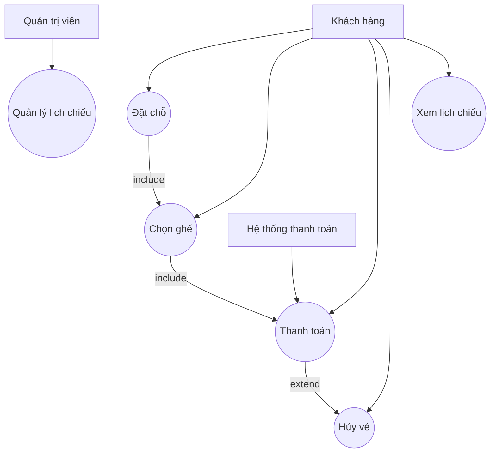

## Các Use Case chính
| Tên Use Case           | Mô tả ngắn gọn                                         | Actor liên quan                 |
| ---------------------- | ------------------------------------------------------ | ------------------------------- |
| **Đặt chỗ**            | Khách hàng chọn phim, ngày chiếu, giờ chiếu            | Khách hàng                      |
| **Chọn ghế**           | Hiển thị sơ đồ ghế để người dùng chọn vị trí mong muốn | Khách hàng                      |
| **Thanh toán**         | Thanh toán online (VNPay, Momo, COD...)                | Khách hàng, Hệ thống thanh toán |
| **Hủy vé**             | Khách hàng có thể hủy vé trong thời gian cho phép      | Khách hàng                      |
| **Xem lịch chiếu**     | Xem danh sách phim, suất chiếu                         | Khách hàng                      |
| **Quản lý lịch chiếu** | Cập nhật phim, giờ chiếu, rạp                          | Quản trị viên                   |

