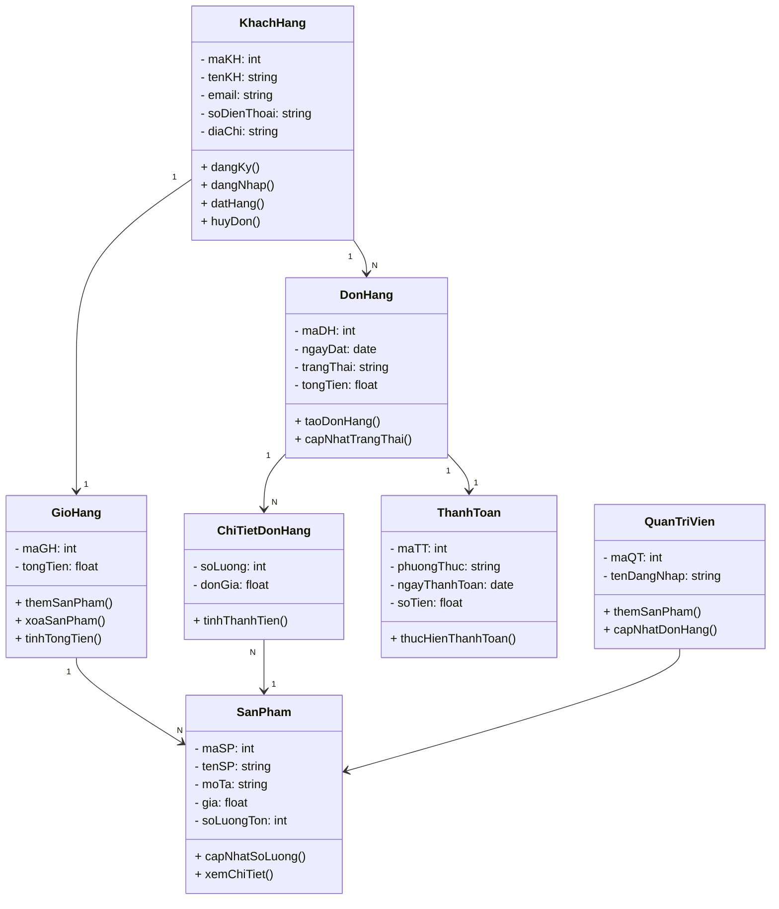

```mermaid
classDiagram

class KhachHang {
  - maKH: int
  - tenKH: string
  - email: string
  - soDienThoai: string
  - diaChi: string
  + dangKy()
  + dangNhap()
  + datHang()
  + huyDon()
}

class SanPham {
  - maSP: int
  - tenSP: string
  - moTa: string
  - gia: float
  - soLuongTon: int
  + capNhatSoLuong()
  + xemChiTiet()
}

class GioHang {
  - maGH: int
  - tongTien: float
  + themSanPham()
  + xoaSanPham()
  + tinhTongTien()
}

class DonHang {
  - maDH: int
  - ngayDat: date
  - trangThai: string
  - tongTien: float
  + taoDonHang()
  + capNhatTrangThai()
}

class ChiTietDonHang {
  - soLuong: int
  - donGia: float
  + tinhThanhTien()
}

class ThanhToan {
  - maTT: int
  - phuongThuc: string
  - ngayThanhToan: date
  - soTien: float
  + thucHienThanhToan()
}

class QuanTriVien {
  - maQT: int
  - tenDangNhap: string
  + themSanPham()
  + capNhatDonHang()
}

%% Quan hệ giữa các lớp
KhachHang "1" --> "1" GioHang
KhachHang "1" --> "N" DonHang 
DonHang "1" --> "N" ChiTietDonHang 
ChiTietDonHang "N" --> "1" SanPham 
DonHang "1" --> "1" ThanhToan 
GioHang "1" --> "N" SanPham 
QuanTriVien --> SanPham 

```