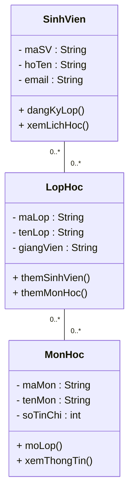

## Phân tích mối quan hệ
| **Quan hệ**                         | **Loại quan hệ**   | **Multiplicity (Bội số)**                                                                       | **Giải thích**                                                                   |
| ----------------------------------- | ------------------ | ----------------------------------------------------------------------------------------------- | -------------------------------------------------------------------------------- |
| **SinhVien – LopHoc**               | N:N (Many-to-Many) | Một Sinh viên có thể học nhiều Lớp học. Một Lớp học có thể có nhiều Sinh viên.               | Biểu diễn qua bảng trung gian **DangKyHoc** hoặc trực tiếp bằng multiplicity N–N |
| **LopHoc – MonHoc**                 | N:N (Many-to-Many) | Một Lớp học có thể dạy nhiều Môn học. Một Môn học có thể được dạy ở nhiều Lớp học khác nhau. | Biểu diễn bằng multiplicity N–N hoặc qua bảng **GiangDay**                       |
| **MonHoc – SinhVien** *(gián tiếp)* | N:N (qua LopHoc)   | Một Sinh viên có thể học nhiều Môn học thông qua nhiều Lớp học.                                 | Không trực tiếp kết nối nhưng có thể truy ngược qua LopHoc                       |
