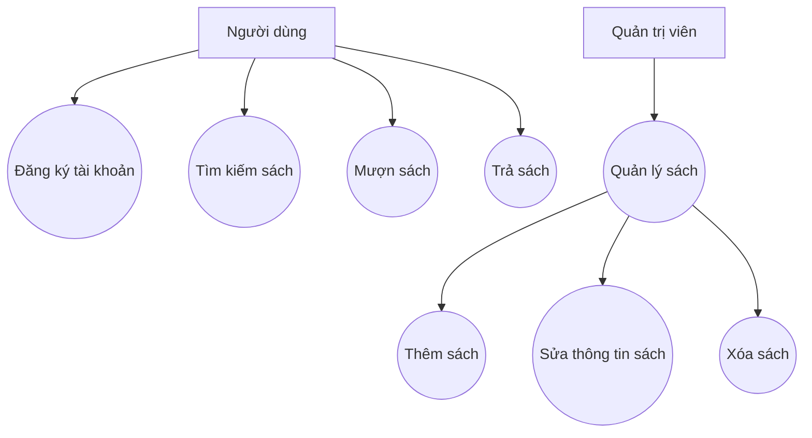
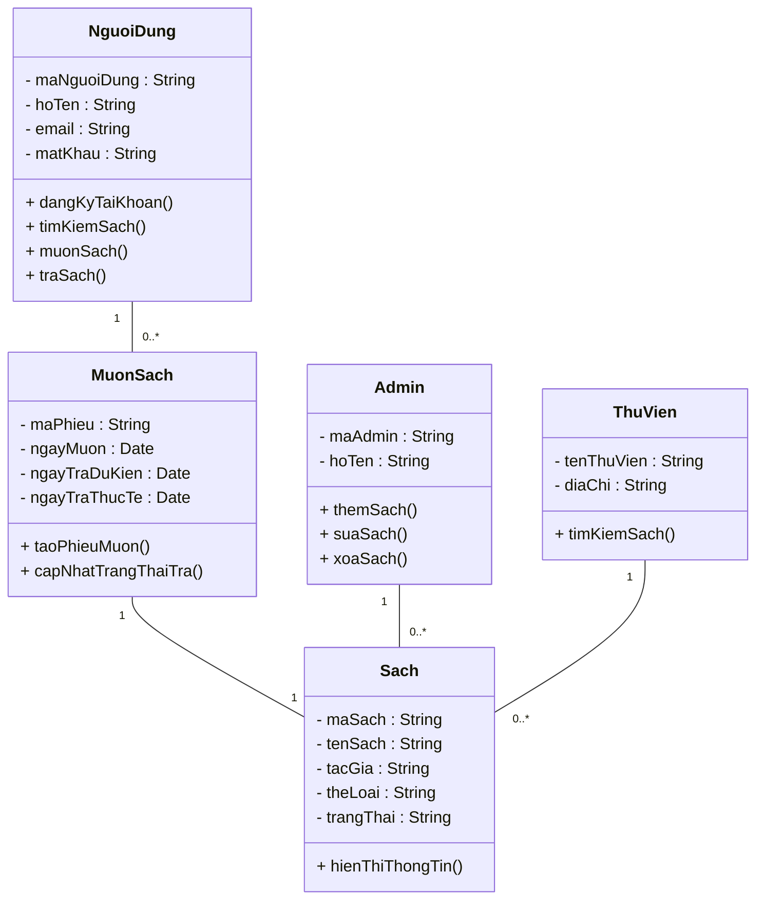

## Sơ đồ Use Case

## Sơ đồ Class Diagram

## Giải thích logic chuyển đổi

| **Bước**                          | **Mô tả**                                                                               | **Kết quả**                                         |
| --------------------------------- |-----------------------------------------------------------------------------------------| --------------------------------------------------- |
| **Xác định actor**                | Dựa vào Use Case Diagram, có 2 actor: *Người dùng*, *Admin*                             | Sinh ra 2 class: `NguoiDung`, `Admin`               |
| **Xác định Use Case chính**   | Từ các hành động (Đăng ký, Mượn, Trả...)                                                | Sinh ra các phương thức tương ứng trong `NguoiDung` |
| **Xác định thực thể (entity)** | Các đối tượng có dữ liệu riêng như `Sach`, `MuonSach`, `ThuVien`                        | Mỗi entity trở thành một class                      |
| **Xác định quan hệ giữa các lớp** | - `NguoiDung` mượn nhiều `Sach` qua `MuonSach` - `Admin` quản lý nhiều `Sach`   | Xây dựng các association (1–N)                      |
|**Gắn Multiplicity**          | Dựa vào hành vi: 1 người dùng → nhiều phiếu mượn, 1 phiếu mượn → 1 sách                 | Bổ sung “1..*”, “1”, “0..*” vào sơ đồ               |
