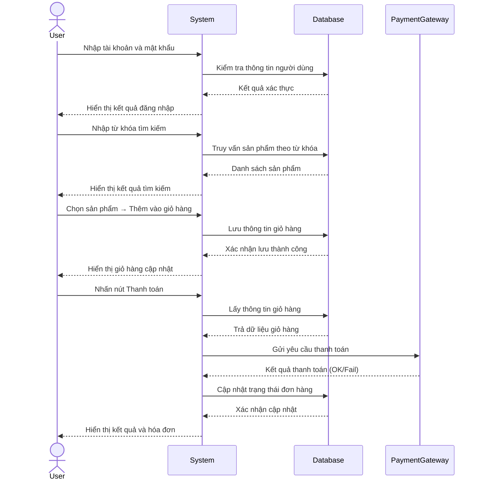

# Trình tự tương tác hệ thống bán hàng

## 1. Đăng nhập

1. **User → System:** Nhập tên đăng nhập và mật khẩu.
2. **System → Database:** Gửi truy vấn kiểm tra thông tin người dùng.
3. **Database → System:** Trả kết quả xác thực (**Hợp lệ / Không hợp lệ**).
4. **System → User:** Hiển thị thông báo đăng nhập **thành công** hoặc **thất bại**.

## 2. Tìm sản phẩm

1. **User → System:** Nhập từ khóa tìm kiếm sản phẩm.
2. **System → Database:** Truy vấn danh sách sản phẩm phù hợp.
3. **Database → System:** Trả kết quả sản phẩm.
4. **System → User:** Hiển thị danh sách sản phẩm tìm được.

## 3. Đặt hàng

1. **User → System:** Chọn sản phẩm muốn mua → “Thêm vào giỏ hàng”.
2. **System → Database:** Ghi thông tin vào bảng Cart hoặc OrderTemp.
3. **Database → System:** Xác nhận thêm thành công.
4. **System → User:** Cập nhật giao diện giỏ hàng.

## 4. Thanh toán

1. **User → System:** Nhấn “Thanh toán”.
2. **System → Database:** Lấy thông tin giỏ hàng
3. **Database → System:** Trả dữ liệu giỏ hàng.
4. **System → Payment Gateway:** Gửi yêu cầu thanh toán (số tiền, mã đơn hàng, phương thức, ...).
5. **Payment Gateway → System:** Trả kết quả giao dịch (**Thành công / Thất bại**).
6. **System → Database:** Cập nhật trạng thái đơn hàng.
7. **Database → System:** Xác nhận cập nhật thành công.
8. **System → User:** Hiển thị thông báo thanh toán thành công và gửi hóa đơn.
