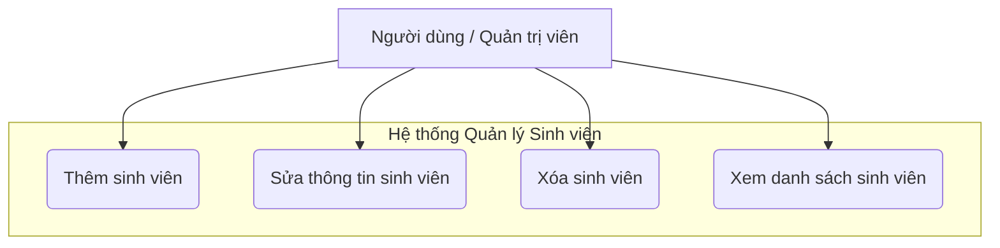
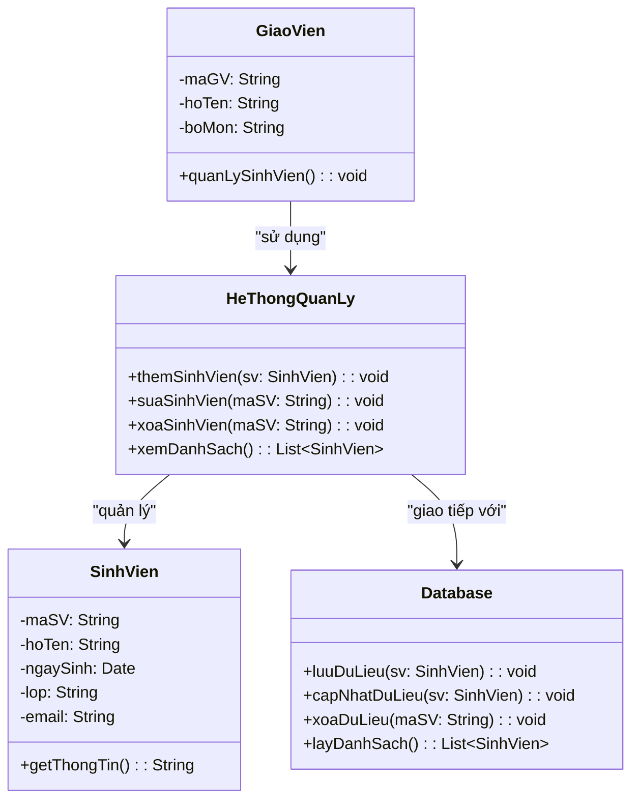
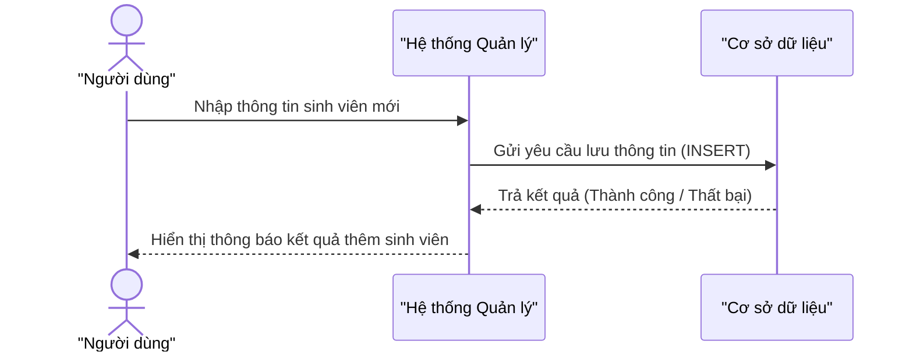

## Use Case Diagram – Hệ thống quản lý sinh viên

## Class Diagram – Các lớp trong hệ thống

## Sequence Diagram – Quy trình “Thêm sinh viên”

# Mối liên hệ giữa 3 sơ đồ

| Sơ đồ                | Mục đích                                                | Liên kết                                                                 |
| -------------------- | ------------------------------------------------------- | ------------------------------------------------------------------------ |
| **Use Case Diagram** | Xác định chức năng chính mà người dùng có thể thực hiện | Use Case “Thêm sinh viên” được chọn để mô tả chi tiết                    |
| **Class Diagram**    | Mô tả cấu trúc các lớp và quan hệ giữa chúng            | Các lớp `SinhVien`, `HeThongQuanLy`, `Database` được dùng trong Sequence |
| **Sequence Diagram** | Thể hiện luồng tương tác cụ thể theo thời gian          | Minh họa chi tiết quá trình từ Use Case → hành vi của các lớp            |
