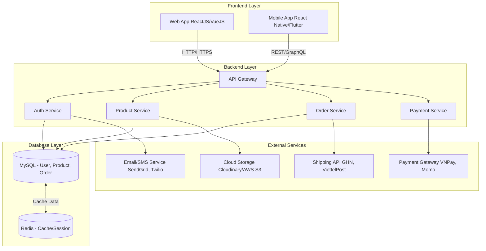

## 1. Mục tiêu

- Xây dựng hệ thống quản lý bán hàng phục vụ cả người dùng web và mobile, cho phép:

- Tìm kiếm và xem sản phẩm

- Thêm sản phẩm vào giỏ hàng

- Thanh toán trực tuyến

- Quản lý đơn hàng và thông tin cá nhân

## 2. Phân tích kiến trúc tổng thể

## Kiến trúc tổng thể: 4 lớp chính

---

### 🧩 1. Frontend

- **Web App:** `ReactJS`, `VueJS`  
  Hiển thị giao diện mua sắm, giỏ hàng, thanh toán, theo dõi đơn hàng.
- **Mobile App:** `React Native`, `Flutter`  
  Trải nghiệm tối ưu cho thiết bị di động.
- **Giao tiếp Backend:** Qua `REST API` hoặc `GraphQL`.

---

### ⚙️ 2. Backend (Application Server)

- **Framework:** `Node.js (Express/NestJS)`, `Java (Spring Boot)`
- **Chức năng:** Xử lý nghiệp vụ: đăng nhập, quản lý sản phẩm, đơn hàng, thanh toán.
- **Triển khai:** API Gateway + Microservices (khi mở rộng).

---

### 🗄️ 3. Database Layer

- **Relational DB:** `MySQL`, `PostgreSQL`  
  Lưu thông tin người dùng, sản phẩm, đơn hàng, giỏ hàng.
- **NoSQL DB:** `Redis`, `MongoDB`  
  Caching session, token, lịch sử tìm kiếm.

---

### 🌐 4. External Services

| Loại dịch vụ             | Công nghệ / Đối tác           | Mục đích                  |
| ------------------------ | ----------------------------- | ------------------------- |
| Payment Gateway          | Momo, VNPay, PayPal           | Thanh toán trực tuyến     |
| Delivery Services        | Giao hàng nhanh, Viettel Post | Giao nhận đơn hàng        |
| Email/SMS                | Gmail API, Twilio, SendGrid   | Gửi thông báo, xác thực   |
| Cloud Storage (Tùy chọn) | AWS S3, Cloudinary            | Lưu trữ hình ảnh sản phẩm |

## 3. Sơ đồ kiến trúc tổng thể (Mermaid)

