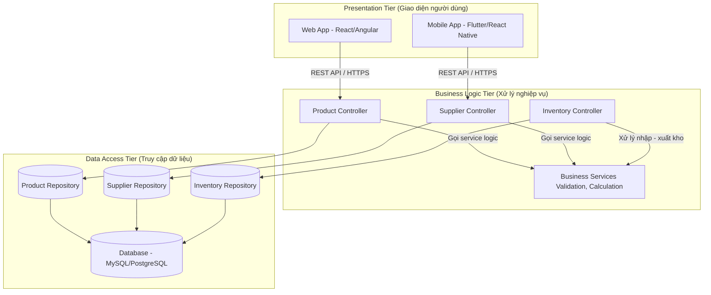

## Mô tả chi tiết từng tầng

| Tầng               | Thành phần           | Mô tả                                                 |
| ------------------ | -------------------- | ----------------------------------------------------- |
| **Presentation**   | Web, Mobile App      | Giao diện người dùng, gửi/nhận dữ liệu qua API        |
| **Business Logic** | Controller, Service  | Xử lý quy tắc nghiệp vụ (tồn kho, nhập xuất, báo cáo) |
| **Data Access**    | Repository, Database | Lưu trữ, truy xuất và quản lý dữ liệu trong CSDL      |
