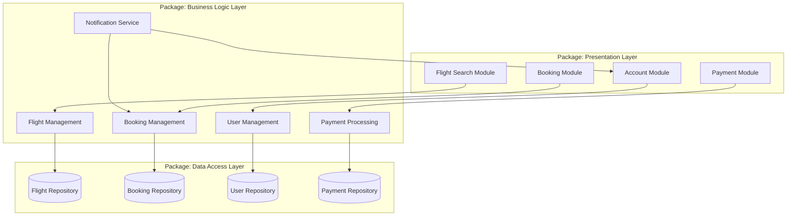

```mermaid
graph TD

  %% ===== TẦNG GIAO DIỆN =====
  subgraph "Package: Presentation Layer"
    UI1[Flight Search Module]
    UI2[Booking Module]
    UI3[Payment Module]
    UI4[Account Module]
  end

  %% ===== TẦNG XỬ LÝ NGHIỆP VỤ =====
  subgraph "Package: Business Logic Layer"
    BL1[Flight Management]
    BL2[Booking Management]
    BL3[Payment Processing]
    BL4[User Management]
    BL5[Notification Service]
  end

  %% ===== TẦNG DỮ LIỆU =====
  subgraph "Package: Data Access Layer"
    DB1[(Flight Repository)]
    DB2[(Booking Repository)]
    DB3[(User Repository)]
    DB4[(Payment Repository)]
  end

  %% ===== KẾT NỐI =====
  UI1 --> BL1
  UI2 --> BL2
  UI3 --> BL3
  UI4 --> BL4

  BL1 --> DB1
  BL2 --> DB2
  BL3 --> DB4
  BL4 --> DB3

  BL5 --> UI4
  BL5 --> BL2

```
