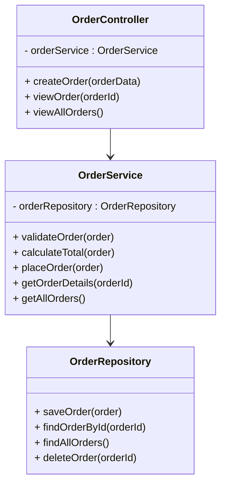

## Mô tả chi tiết các lớp và phương thức

| **Lớp**             | **Tầng**     | **Phương thức**            | **Mô tả chức năng**                                                         |
| ------------------- | ------------ | -------------------------- | --------------------------------------------------------------------------- |
| **OrderController** | Presentation | `createOrder(orderData)`   | Nhận yêu cầu đặt hàng từ người dùng, gửi tới `OrderService`.                |
|                     |              | `viewOrder(orderId)`       | Hiển thị chi tiết đơn hàng.                                                 |
|                     |              | `viewAllOrders()`          | Hiển thị danh sách tất cả đơn hàng.                                         |
| **OrderService**    | Business     | `validateOrder(order)`     | Kiểm tra dữ liệu đơn hàng hợp lệ (sản phẩm tồn tại, số lượng hợp lý, v.v.). |
|                     |              | `calculateTotal(order)`    | Tính tổng tiền, thuế, khuyến mãi cho đơn hàng.                              |
|                     |              | `placeOrder(order)`        | Gọi repository để lưu đơn hàng sau khi hợp lệ.                              |
|                     |              | `getOrderDetails(orderId)` | Lấy chi tiết đơn hàng từ repository.                                        |
|                     |              | `getAllOrders()`           | Lấy toàn bộ danh sách đơn hàng.                                             |
| **OrderRepository** | Data         | `saveOrder(order)`         | Ghi đơn hàng vào cơ sở dữ liệu.                                             |
|                     |              | `findOrderById(orderId)`   | Truy vấn chi tiết đơn hàng theo ID.                                         |
|                     |              | `findAllOrders()`          | Lấy danh sách tất cả đơn hàng.                                              |
|                     |              | `deleteOrder(orderId)`     | Xóa đơn hàng khỏi cơ sở dữ liệu.                                            |
