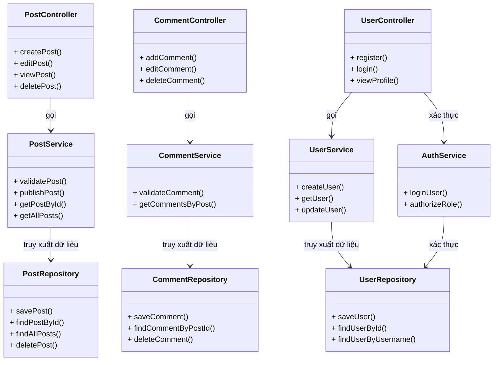

## Mô tả vai trò từng module

| **Tầng**           | **Module**          | **Vai trò**                                               |
| ------------------ | ------------------- | --------------------------------------------------------- |
| **Presentation**   | `PostController`    | Nhận yêu cầu từ người dùng về bài viết (tạo, xem, xóa).   |
|                    | `CommentController` | Quản lý bình luận người dùng.                             |
|                    | `UserController`    | Xử lý đăng ký, đăng nhập, hồ sơ người dùng.               |
| **Business Logic** | `PostService`       | Xử lý logic bài viết (kiểm tra nội dung, định dạng, lưu). |
|                    | `CommentService`    | Xử lý logic bình luận (kiểm duyệt, liên kết bài viết).    |
|                    | `UserService`       | Xử lý thông tin người dùng và cập nhật tài khoản.         |
|                    | `AuthService`       | Xác thực người dùng, phân quyền.                          |
| **Data Access**    | `PostRepository`    | Thao tác CRUD với bảng `Posts`.                           |
|                    | `CommentRepository` | Quản lý dữ liệu `Comments`.                               |
|                    | `UserRepository`    | Quản lý dữ liệu người dùng (`Users`).                     |
