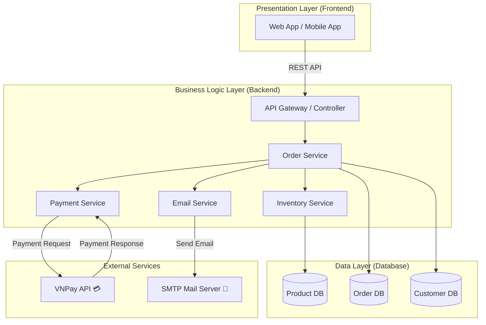

## Mô tả chi tiết các thành phần

| **Thành phần**                          | **Vai trò chính**                                                         |
| --------------------------------------- | ------------------------------------------------------------------------- |
| **Web App / Mobile App**                | Giao diện người dùng, hiển thị sản phẩm, thanh toán, xem đơn hàng.        |
| **API Gateway / Controller**            | Trung gian giữa frontend và các service backend.                          |
| **Order Service**                       | Xử lý nghiệp vụ đặt hàng, tổng tiền, cập nhật đơn hàng.                   |
| **Inventory Service**                   | Quản lý số lượng sản phẩm trong kho, cập nhật khi có giao dịch.           |
| **Payment Service**                     | Gọi đến VNPay API để xác nhận và xử lý giao dịch thanh toán.              |
| **Email Service**                       | Gửi email xác nhận cho khách hàng qua SMTP sau khi thanh toán thành công. |
| **Product DB / Order DB / Customer DB** | Lưu dữ liệu sản phẩm, đơn hàng và người dùng.                             |
| **VNPay API (External)**                | Dịch vụ thanh toán online do VNPay cung cấp.                              |
| **SMTP Mail Server (External)**         | Dịch vụ gửi email xác nhận đơn hàng.                                      |
