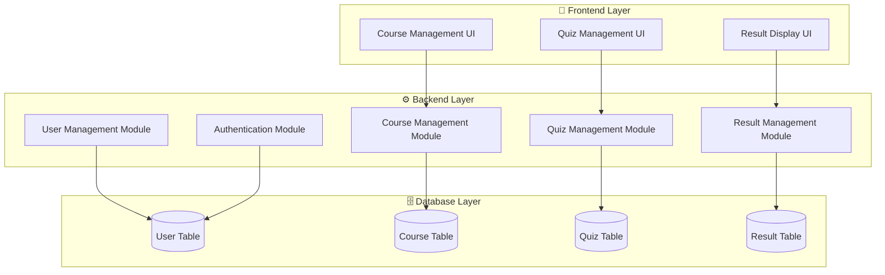

## Bảng Mapping Use Case → Module
| **Use Case**      | **Module tương ứng** | **Tầng kiến trúc**      | **Mô tả chức năng chính**                                |
| ----------------- | -------------------- | ----------------------- | -------------------------------------------------------- |
| Đăng ký tài khoản | User Management      | Backend, Database       | Quản lý thông tin người dùng, lưu dữ liệu người dùng mới |
| Đăng nhập         | Authentication       | Backend                 | Xác thực thông tin người dùng, tạo session/token         |
| Xem khóa học      | Course Management    | Frontend + Backend      | Hiển thị danh sách khóa học, lấy dữ liệu từ DB           |
| Làm bài quiz      | Quiz Management      | Frontend + Backend      | Giao diện làm quiz, tính điểm tạm thời                   |
| Xem kết quả       | Result Management    | Frontend + Backend + DB | Hiển thị kết quả, lưu lịch sử làm bài và điểm số         |
