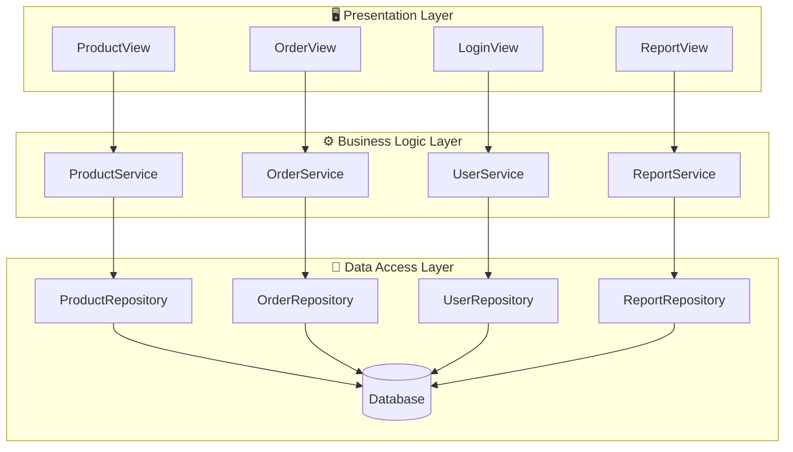

## Mô tả kiến trúc từng lớp
| **Tầng**                                  | **Vai trò**                                                                          | **Các thành phần (Modules / Classes)**                                                     |
| ----------------------------------------- | ------------------------------------------------------------------------------------ | ------------------------------------------------------------------------------------------ |
| **Presentation Layer (Tầng trình bày)**   | Giao diện người dùng (Web hoặc Mobile). Gửi yêu cầu đến backend và hiển thị dữ liệu. | - `ProductView` - `OrderView` - `LoginView` - `ReportView`                        |
| **Business Logic Layer (Tầng nghiệp vụ)** | Xử lý các nghiệp vụ như kiểm tra tính hợp lệ, tính toán doanh thu, xử lý đơn hàng.   | - `ProductService` - `OrderService` - `UserService` - `ReportService`             |
| **Data Access Layer (Tầng dữ liệu)**      | Giao tiếp trực tiếp với cơ sở dữ liệu, thực hiện CRUD.                               | - `ProductRepository` - `OrderRepository` - `UserRepository` - `ReportRepository` |
