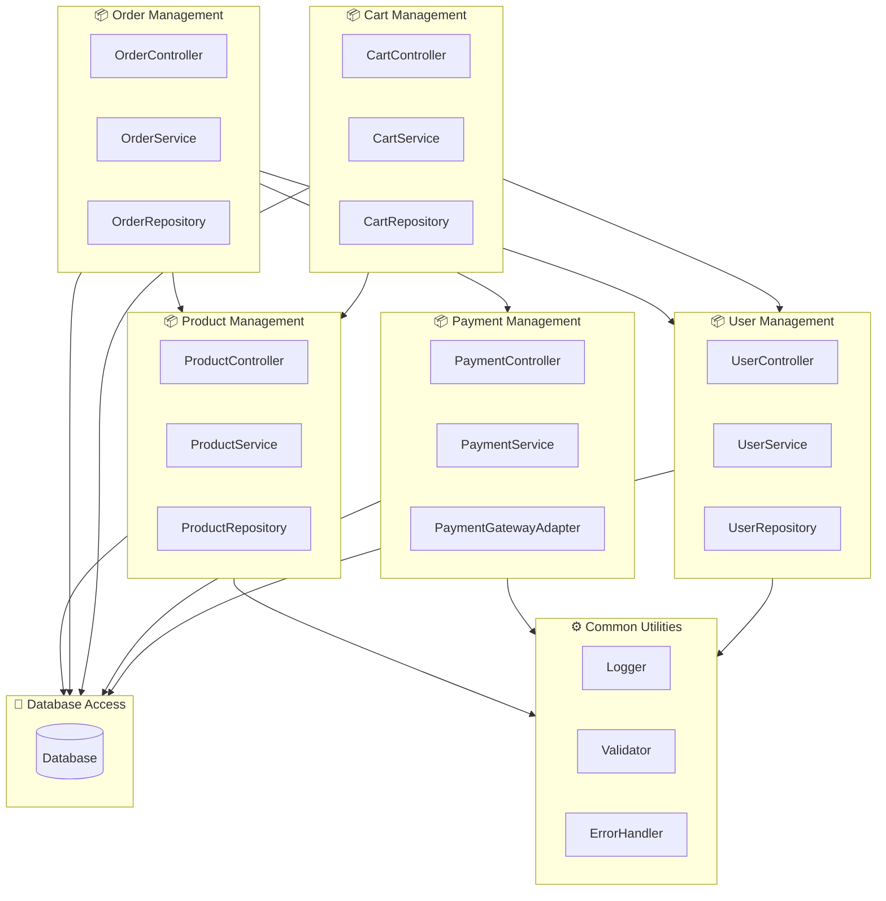

## Các Package chính và vai trò
| **Package**            | **Vai trò**                                                           |
| ---------------------- | --------------------------------------------------------------------- |
| **Product Management** | Quản lý sản phẩm: thêm, sửa, xóa, xem chi tiết.                       |
| **Order Management**   | Quản lý đơn hàng: tạo, cập nhật trạng thái, xem lịch sử mua.          |
| **Cart Management**    | Quản lý giỏ hàng của người dùng, lưu tạm các sản phẩm chọn mua.       |
| **Payment Management** | Xử lý thanh toán trực tuyến thông qua các API dịch vụ ngoài.          |
| **User Management**    | Quản lý thông tin tài khoản, xác thực đăng nhập, đăng ký.             |
| **Database Access**    | Giao tiếp với cơ sở dữ liệu, truy vấn và lưu trữ dữ liệu.             |
| **Common Utilities**   | Chứa các hàm, lớp dùng chung như logging, error handling, validation. |

## Giải thích về dependency
- Order Management → Product / User / Payment:
Đơn hàng cần thông tin sản phẩm, người mua và xử lý thanh toán.

- Cart Management → Product / User:
Giỏ hàng lưu danh sách sản phẩm tạm thời của người dùng trước khi thanh toán.

- Payment Management → Common:
Dùng các tiện ích kiểm tra lỗi, logging, gọi API cổng thanh toán ngoài.

- User / Product / Order → Database:
Các package này truy xuất dữ liệu người dùng, sản phẩm, đơn hàng từ DB.

- Common Utilities:
Không phụ thuộc vào package khác, chỉ cung cấp tiện ích cho toàn hệ thống.