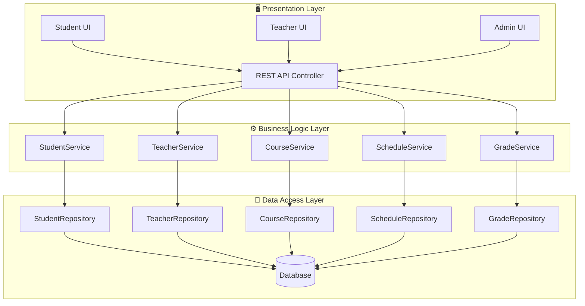
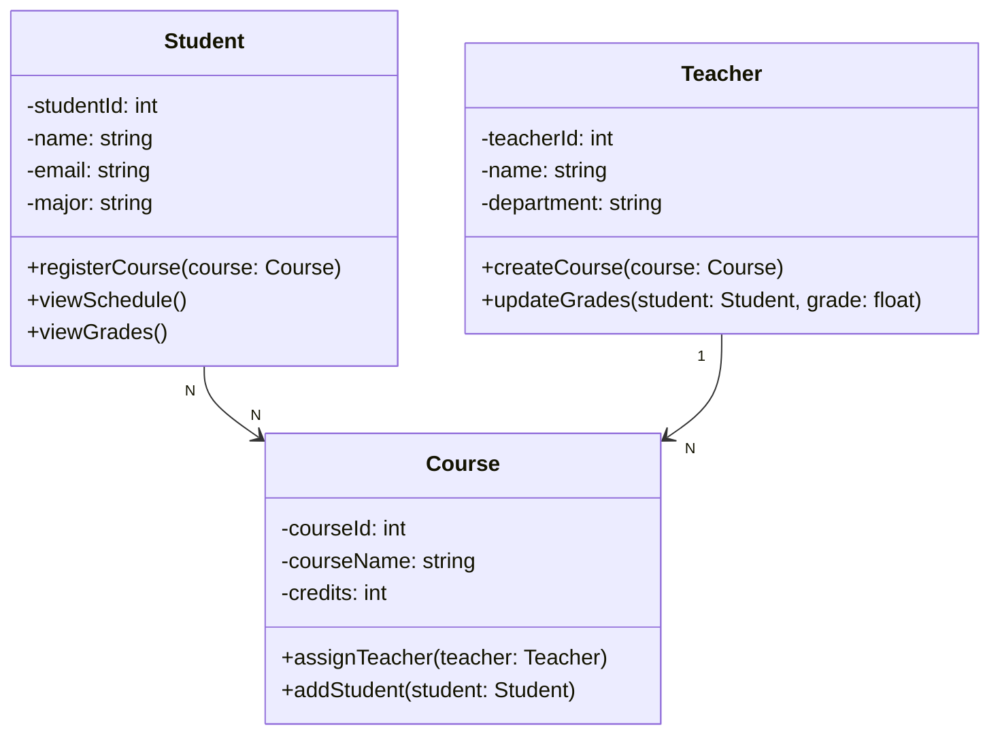
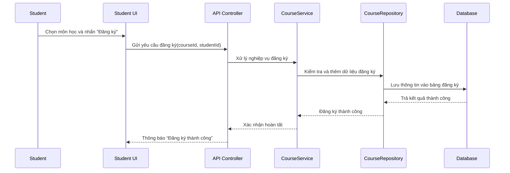

## Sơ đồ module

```mermaid
graph TB
    subgraph Presentation["🖥️ Presentation Layer"]
        UI1[Student UI]
        UI2[Teacher UI]
        UI3[Admin UI]
        API[REST API Controller]
    end

    subgraph Business["⚙️ Business Logic Layer"]
        SVC1[StudentService]
        SVC2[TeacherService]
        SVC3[CourseService]
        SVC4[ScheduleService]
        SVC5[GradeService]
    end

    subgraph Data["💾 Data Access Layer"]
        REP1[StudentRepository]
        REP2[TeacherRepository]
        REP3[CourseRepository]
        REP4[ScheduleRepository]
        REP5[GradeRepository]
        DB[(Database)]
    end

    %% Dependency connections
    UI1 --> API
    UI2 --> API
    UI3 --> API

    API --> SVC1
    API --> SVC2
    API --> SVC3
    API --> SVC4
    API --> SVC5

    SVC1 --> REP1
    SVC2 --> REP2
    SVC3 --> REP3
    SVC4 --> REP4
    SVC5 --> REP5

    REP1 --> DB
    REP2 --> DB
    REP3 --> DB
    REP4 --> DB
    REP5 --> DB

```

## Thiết kế Class Diagram

```mermaid
classDiagram
    class Student {
        -studentId: int
        -name: string
        -email: string
        -major: string
        +registerCourse(course: Course)
        +viewSchedule()
        +viewGrades()
    }

    class Teacher {
        -teacherId: int
        -name: string
        -department: string
        +createCourse(course: Course)
        +updateGrades(student: Student, grade: float)
    }

    class Course {
        -courseId: int
        -courseName: string
        -credits: int
        +assignTeacher(teacher: Teacher)
        +addStudent(student: Student)
    }

    Student "N" --> "N" Course 
    Teacher "1" --> "N" Course 

```

## Sequence Diagram – Nghiệp vụ “Sinh viên đăng ký môn học”

```mermaid
sequenceDiagram
    participant Student
    participant UI as Student UI
    participant API as API Controller
    participant SVC as CourseService
    participant REP as CourseRepository
    participant DB as Database

    Student ->> UI: Chọn môn học và nhấn "Đăng ký"
    UI ->> API: Gửi yêu cầu đăng ký(courseId, studentId)
    API ->> SVC: Xử lý nghiệp vụ đăng ký
    SVC ->> REP: Kiểm tra và thêm dữ liệu đăng ký
    REP ->> DB: Lưu thông tin vào bảng đăng ký
    DB -->> REP: Trả kết quả thành công
    REP -->> SVC: Đăng ký thành công
    SVC -->> API: Xác nhận hoàn tất
    API -->> UI: Thông báo “Đăng ký thành công”
    
```