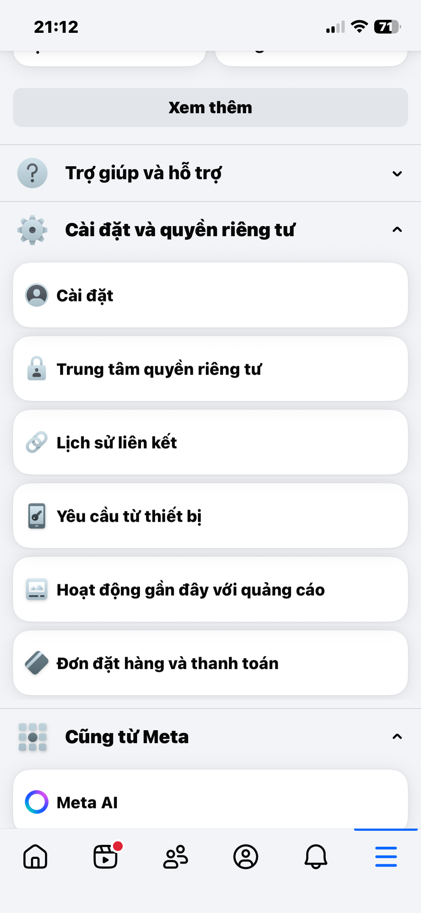
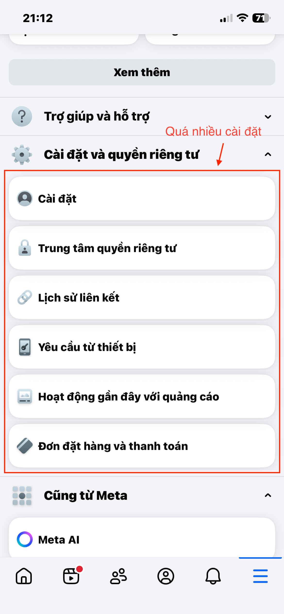

# 🧩 Phân tích giao diện UI/UX thực tế

## 📷 Ảnh gốc

.PNG)

---

## 🖍️ Ảnh chú thích lỗi UI

---

## 💬 Nhận xét tổng quan
Khi truy cập vào **mục “Cài đặt & quyền riêng tư → Cài đặt → Bảo mật và đăng nhập”** của Facebook, cảm giác đầu tiên là **rất nhiều thông tin và lựa chọn chồng chéo**, khiến người dùng mới dễ bị choáng.  
Các phần quan trọng như “Đổi mật khẩu”, “Cảnh báo đăng nhập lạ” và “Xác thực hai yếu tố” bị đặt trong danh sách dài, không có thứ tự ưu tiên rõ ràng.  
Giao diện nhiều chữ, ít biểu tượng minh họa nên người dùng **phải đọc nhiều, mất thời gian tìm đúng tính năng**.

---

## 🧠 Phân tích lỗi UI/UX chi tiết

| Loại lỗi | Mô tả chi tiết |
|----------|----------------|
| 🎨 **Màu sắc & Tương phản** | Toàn bộ phần cài đặt dùng nền trắng – chữ đen đơn điệu, không có màu nhấn cho mục quan trọng như “Xác thực hai yếu tố”. |
| 🧩 **Bố cục** | Cấu trúc dạng danh sách kéo dài, các mục nhỏ (ví dụ: “Đổi mật khẩu”) nằm sâu trong nhiều cấp menu. Người dùng phải cuộn nhiều hoặc bấm qua nhiều lớp. |
| 🖱️ **Hành vi / Tương tác** | Khi thay đổi cài đặt (ví dụ: bật xác thực 2FA), trang tải lại chậm và không có phản hồi rõ ràng. Một số nút nhỏ, dễ bỏ sót. |
| 📱 **Trải nghiệm UX tổng thể** | Thông tin dày đặc, từ ngữ kỹ thuật (“Phê duyệt đăng nhập”, “Trình xác thực”) gây khó hiểu cho người không am hiểu công nghệ. Không có hướng dẫn trực quan hoặc biểu tượng minh họa. |

---

## 🔍 Nguyên nhân tiềm ẩn
- Facebook thiết kế trang này **phục vụ nhiều đối tượng người dùng và tính năng**, dẫn đến quá tải nội dung.
- Thiếu **phân cấp thị giác (visual hierarchy)** khiến người dùng không biết nên chú ý phần nào trước.
- Ưu tiên tính năng hơn trải nghiệm — **tập trung hiển thị đầy đủ tùy chọn**, thay vì dẫn dắt người dùng theo luồng bảo mật cơ bản.
- **Ngôn ngữ dịch thuật kỹ thuật** (từ tiếng Anh sang tiếng Việt) chưa được tối ưu cho người phổ thông.

---

## 💡 Đề xuất cải tiến

| Hạng mục | Gợi ý cải tiến cụ thể |
|-----------|-----------------------|
| 🎨 **Màu sắc** | Thêm màu nhấn (ví dụ: xanh lam hoặc cam) cho các tùy chọn bảo mật quan trọng; sử dụng icon khóa hoặc cảnh báo để phân biệt. |
| 🧱 **Bố cục** | Gom nhóm tính năng theo cấp độ ưu tiên: “Bảo mật cơ bản”, “Đăng nhập nâng cao”, “Quản lý thiết bị”; thêm tiêu đề phụ và icon giúp nhận diện nhanh. |
| 🖱️ **Nút hành động** | Tăng kích thước và độ nổi bật của nút “Chỉnh sửa” hoặc “Bật xác thực 2 bước”; hiển thị xác nhận sau khi người dùng thay đổi cài đặt. |
| 📲 **Tương tác người dùng** | Thêm hướng dẫn ngắn (tooltip / mô tả đơn giản) khi người dùng di chuột vào tùy chọn phức tạp. |
| ⚙️ **Tối ưu trải nghiệm** | Cho phép bật/tắt các tính năng quan trọng ngay tại trang chính (toggle switch), thay vì mở popup phụ. |

---

## 🧭 UI sau cải tiến (tuỳ chọn)

- Chia trang thành 3 phần rõ ràng:  
  **(1)** Bảo mật cơ bản – đổi mật khẩu, xác minh email.  
  **(2)** Đăng nhập & xác thực – 2FA, cảnh báo đăng nhập lạ.  
  **(3)** Quản lý thiết bị & quyền truy cập.
- Dùng icon trực quan (🔒, 📱, ⚠️) và thanh trạng thái bật/tắt để dễ thao tác.
- Hiển thị thông báo nổi “✅ Đã lưu thay đổi” sau mỗi thao tác.

---

