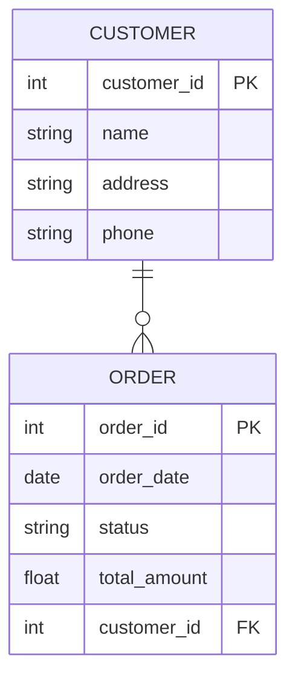

```mermaid
erDiagram
    CUSTOMER {
        int customer_id PK
        string name
        string address
        string phone
    }

    ORDER {
        int order_id PK
        date order_date
        string status
        float total_amount
        int customer_id FK
    }

    CUSTOMER ||--o{ ORDER : ""

```