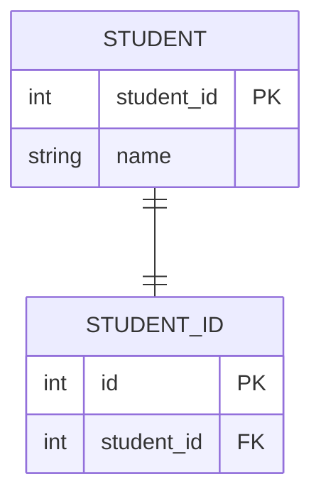
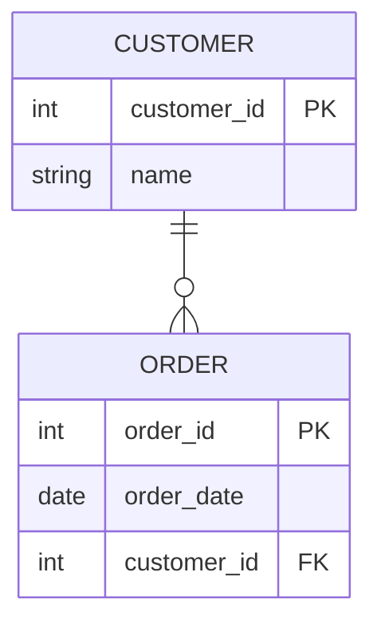
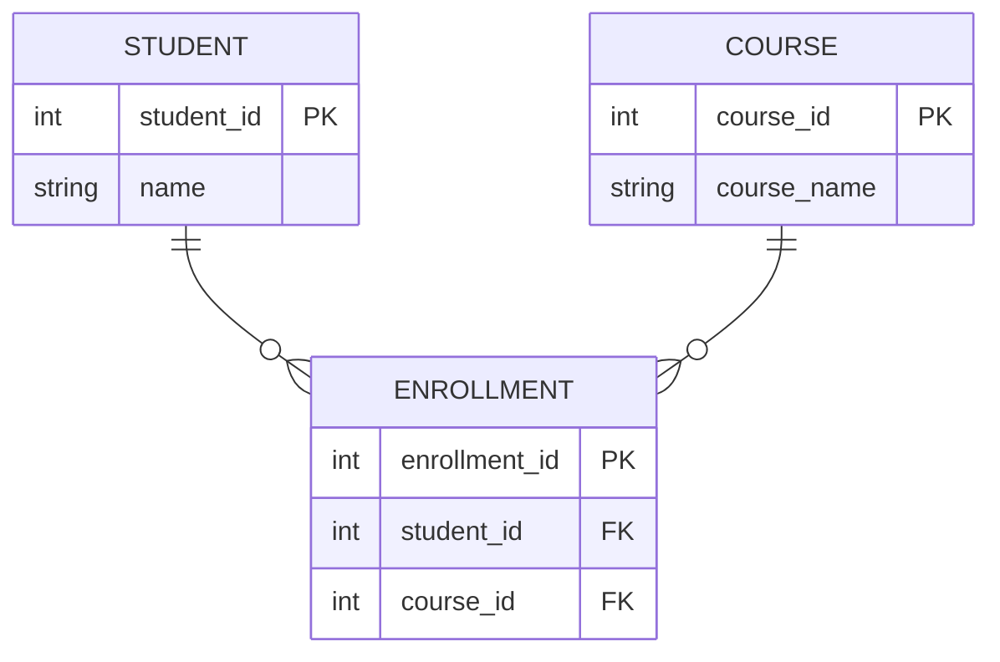

# Tình huống 1: Một sinh viên có một mã sinh viên duy nhất

# Tình huống 2: Một khách hàng có thể đặt nhiều đơn hàng

# Tình huống 3: Một sinh viên có thể học nhiều môn học, và mỗi môn học có nhiều sinh viên
