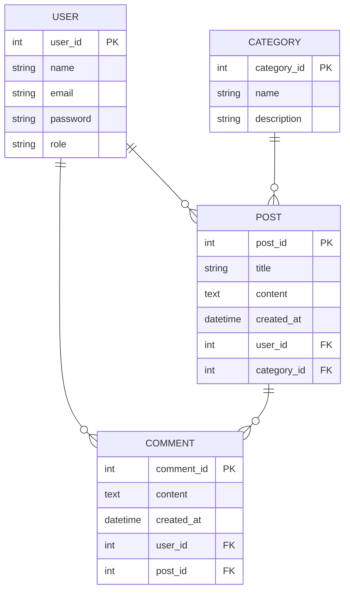

```mermaid
erDiagram
    USER {
        int user_id PK
        string name
        string email
        string password
        string role
    }

    CATEGORY {
        int category_id PK
        string name
        string description
    }

    POST {
        int post_id PK
        string title
        text content
        datetime created_at
        int user_id FK
        int category_id FK
    }

    COMMENT {
        int comment_id PK
        text content
        datetime created_at
        int user_id FK
        int post_id FK
    }

    %% Quan hệ giữa các thực thể
    USER ||--o{ POST : ""
    USER ||--o{ COMMENT : ""
    CATEGORY ||--o{ POST : ""
    POST ||--o{ COMMENT : ""

```