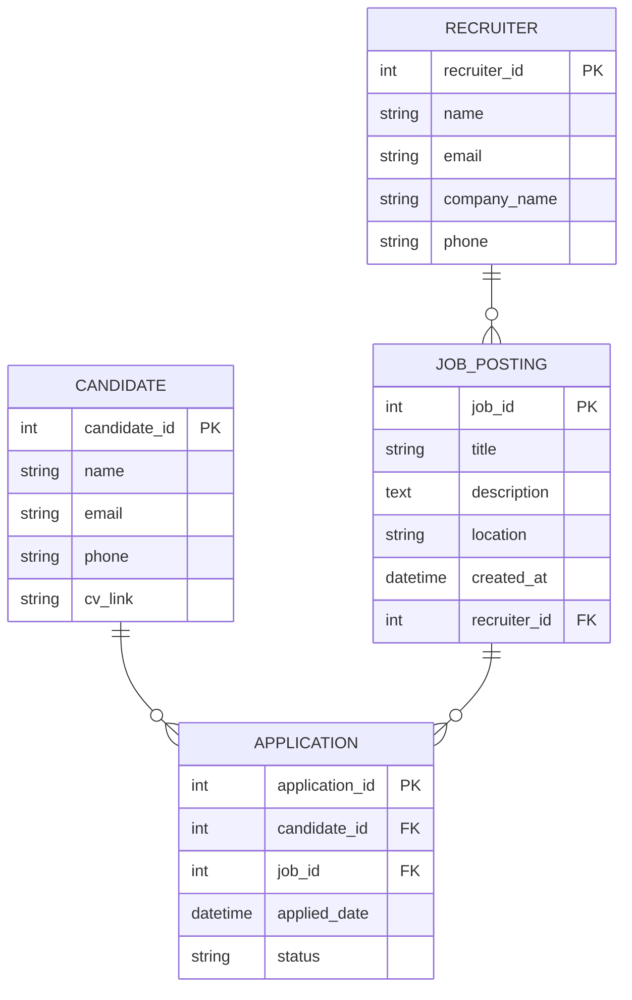

```mermaid
erDiagram
    CANDIDATE {
        int candidate_id PK
        string name
        string email
        string phone
        string cv_link
    }

    RECRUITER {
        int recruiter_id PK
        string name
        string email
        string company_name
        string phone
    }

    JOB_POSTING {
        int job_id PK
        string title
        text description
        string location
        datetime created_at
        int recruiter_id FK
    }

    APPLICATION {
        int application_id PK
        int candidate_id FK
        int job_id FK
        datetime applied_date
        string status
    }

    %% Quan hệ giữa các thực thể
    RECRUITER ||--o{ JOB_POSTING : ""
    CANDIDATE ||--o{ APPLICATION : ""
    JOB_POSTING ||--o{ APPLICATION : ""

```