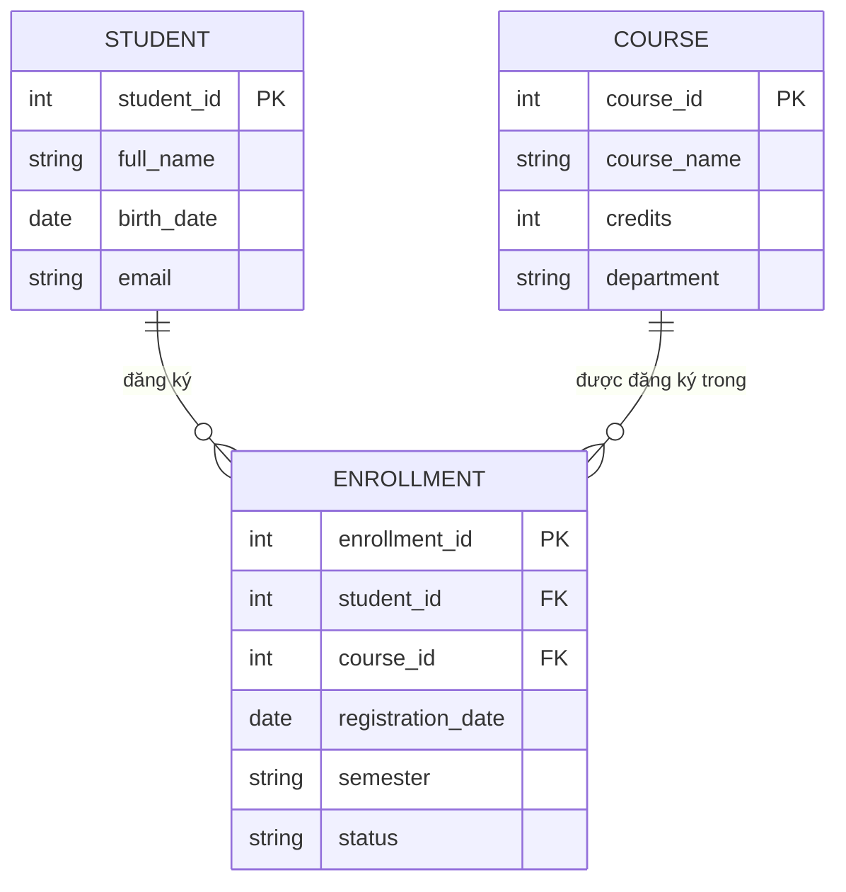

```mermaid
erDiagram
    STUDENT {
        int student_id PK
        string full_name
        date birth_date
        string email
    }

    COURSE {
        int course_id PK
        string course_name
        int credits
        string department
    }

    ENROLLMENT {
        int enrollment_id PK
        int student_id FK
        int course_id FK
        date registration_date
        string semester
        string status
    }

    %% Mối quan hệ giữa các thực thể
    STUDENT ||--o{ ENROLLMENT : "đăng ký"
    COURSE ||--o{ ENROLLMENT : "được đăng ký trong"

```