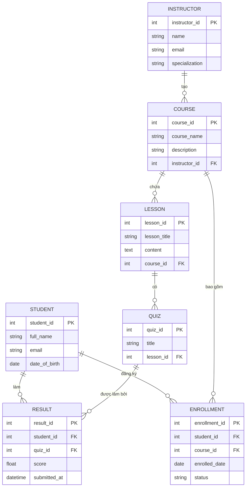

```mermaid
erDiagram
    STUDENT {
        int student_id PK
        string full_name
        string email
        date date_of_birth
    }

    INSTRUCTOR {
        int instructor_id PK
        string name
        string email
        string specialization
    }

    COURSE {
        int course_id PK
        string course_name
        string description
        int instructor_id FK
    }

    LESSON {
        int lesson_id PK
        string lesson_title
        text content
        int course_id FK
    }

    QUIZ {
        int quiz_id PK
        string title
        int lesson_id FK
    }

    ENROLLMENT {
        int enrollment_id PK
        int student_id FK
        int course_id FK
        date enrolled_date
        string status
    }

    RESULT {
        int result_id PK
        int student_id FK
        int quiz_id FK
        float score
        datetime submitted_at
    }

    %% Mối quan hệ
    INSTRUCTOR ||--o{ COURSE : "tạo"
    COURSE ||--o{ LESSON : "chứa"
    LESSON ||--o{ QUIZ : "có"
    STUDENT ||--o{ ENROLLMENT : "đăng ký"
    COURSE ||--o{ ENROLLMENT : "bao gồm"
    STUDENT ||--o{ RESULT : "làm"
    QUIZ ||--o{ RESULT : "được làm bởi"

```